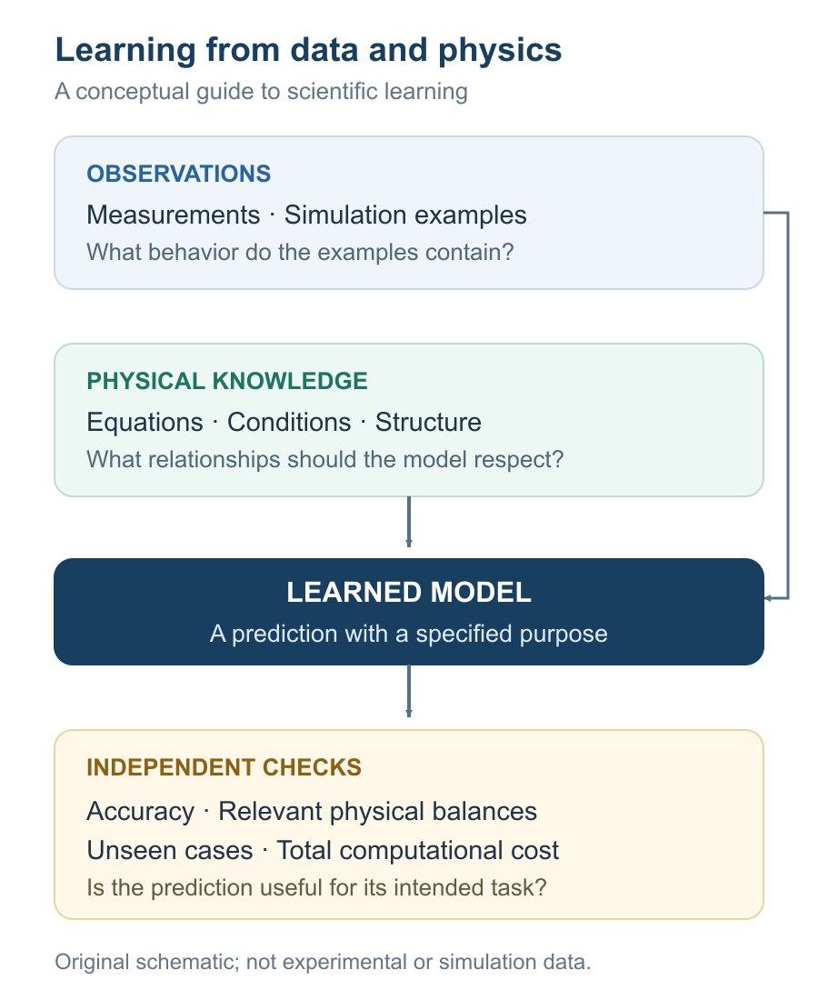
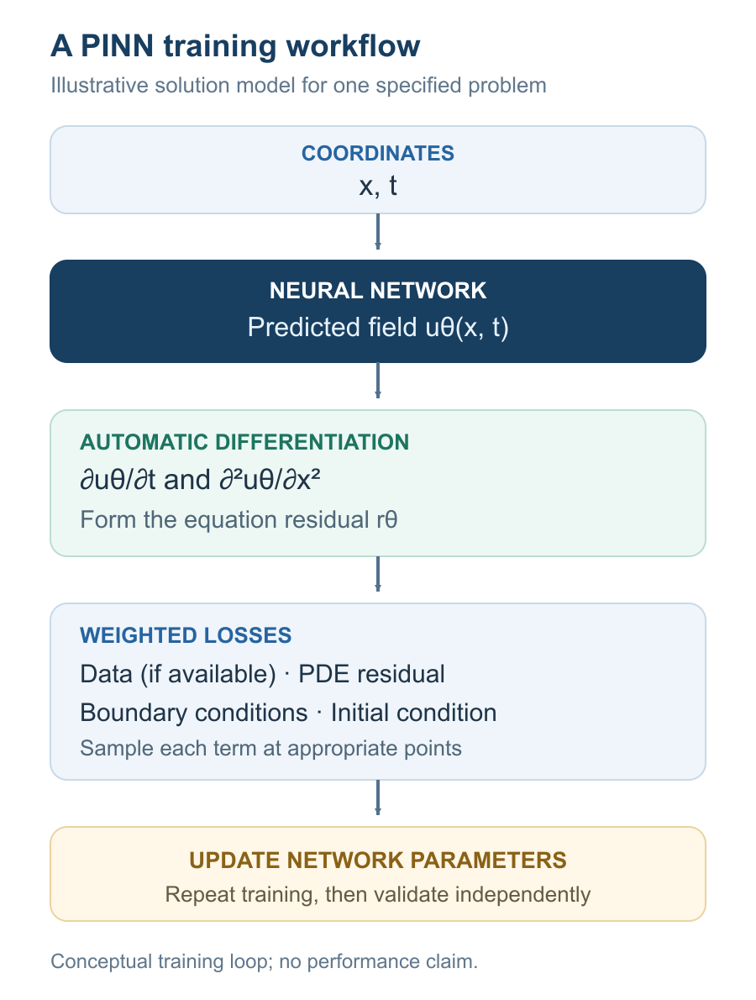

# Can AI Learn Physics? Introduction to Scientific Machine Learning

When I work on a simulation, the goal is to understand how a physical system behaves: where heat travels, how a flow develops, or how different phenomena influence one another. A colorful prediction is useful only when its physical meaning can be checked.

That is the perspective from which I approach the question in this title. What should we ask an AI model to learn, and how would we know that it learned something useful?

This introduction draws on three reviews: Herrmann and Kollmannsberger on computational mechanics [1], Karniadakis and colleagues on physics-informed learning [2], and Brunton and colleagues on fluid mechanics [3]. Additional research papers support the method-specific examples below.

## What is scientific machine learning?

For this post, **scientific machine learning (SciML)** means using machine learning to help answer scientific questions about physical systems. **Physics-informed machine learning** is one part of that broader landscape: it combines observations with mathematical descriptions of physics. Karniadakis and colleagues discuss using this combination for both forward prediction and inverse inference, including situations with incomplete knowledge or data. Physical information can enter through the learning objective or through the model's structure; PINNs are one approach within this field. [2](https://www.nature.com/articles/s42254-021-00314-5)

*Figure 1. Original explanatory schematic informed by the physics-informed learning perspective in [2](https://www.nature.com/articles/s42254-021-00314-5). The validation questions are practical suggestions for this article.*

## Decide what the model should learn

Herrmann and Kollmannsberger distinguish replacing a simulation with a learned model from enhancing part of an existing simulation. This is a useful starting point: the learning task need not be an entire flow field. [1](https://link.springer.com/article/10.1007/s00466-023-02434-4)

| Role | Learning target | Relationship to the solver |
| --- | --- | --- |
| Data-driven surrogate | An input–output relationship from examples | Approximates selected simulation outputs |
| Physics-informed solution model | A field constrained by equations and conditions | Approximates a PDE solution |
| Hybrid enhancement | A component, such as a constitutive relation | Works inside an existing solver |

*These selected roles simplify the broader taxonomy in [1](https://link.springer.com/article/10.1007/s00466-023-02434-4); they are not an exhaustive or mutually exclusive classification.*

The review also cautions against judging speed from model evaluation alone while omitting training. An engineering comparison should account for the effort required to reach the target accuracy. [1](https://link.springer.com/article/10.1007/s00466-023-02434-4)

## How a PINN brings an equation into learning

Raissi, Perdikaris, and Karniadakis use a neural network to approximate a solution field, with automatic differentiation providing derivatives for an equation residual. [4](https://doi.org/10.1016/j.jcp.2018.10.045)

For source-free, dimensionless heat diffusion with constant α, a predicted field uθ gives

$$
r_\theta(x,t)=\frac{\partial u_\theta}{\partial t}-\alpha\frac{\partial^2 u_\theta}{\partial x^2}.
$$

A representative objective is

$$
\mathcal{L}=\lambda_d\mathcal{L}_{\mathrm{data}}+\lambda_r\mathcal{L}_{\mathrm{PDE}}+\lambda_b\mathcal{L}_{\mathrm{BC}}+\lambda_i\mathcal{L}_{\mathrm{IC}}.
$$

The terms penalize observation, interior residual, boundary, and initial-condition errors. The λ values are weights. Without observations, the data term is omitted. This simplifies the construction in [4](https://doi.org/10.1016/j.jcp.2018.10.045).

*Figure 2. Original training schematic based on [4](https://doi.org/10.1016/j.jcp.2018.10.045); no model was trained for this illustration.*

### A small calculation makes the residual concrete

Here is an independently constructed example. Set α = 1 on 0 ≤ x ≤ 1, use zero values at both boundaries, and choose the initial profile sin(πx).

Try the function u(x,t) = exp(−t) sin(πx). It meets the boundary and initial conditions, but direct differentiation gives r = (π² − 1) exp(−t) sin(πx), which is generally nonzero. Replacing exp(−t) with exp(−π²t) makes the residual zero.

The initial shape can therefore be correct while the cooling rate is wrong. This calculation demonstrates what an equation check asks of a prediction. It is not evidence that a neural network will successfully find the correct function.

## Learning a solution versus learning an operator

Kovachki and colleagues describe **neural operators** as models of mappings between function spaces. For PDE applications, the input can be a coefficient field and the output a solution field. Their framework also addresses sharing parameters across discretizations. [5](https://jmlr.org/papers/v24/21-1524.html)

A conventional PINN for one fixed problem approximates a particular solution. An operator model instead targets a relationship across a family of problems. An illustrative thermal example would map an initial temperature profile to the profile at a specified later time, with the domain and other conditions fixed.

Being designed for different discretizations does not establish accuracy for every unfamiliar physical regime. The paper separates approximation results from the practical problem of learning with finite parameters and finite training samples. [5](https://jmlr.org/papers/v24/21-1524.html)

## Why fluid mechanics is a compelling application

Brunton, Noack, and Koumoutsakos review uses ranging from compact flow representations to turbulence modeling and flow control. The opportunity is broader than replacing CFD. [3](https://www.annualreviews.org/content/journals/10.1146/annurev-fluid-010719-060214)

| Application | What learning contributes |
| --- | --- |
| Reduced-order modeling | Describes flow dynamics using a smaller representation |
| Flow reconstruction | Infers fields from limited measurements |
| Turbulence closure | Models effects of unresolved scales |
| Flow control | Helps choose actions that influence a flow |

*Selected applications summarized from [3](https://www.annualreviews.org/content/journals/10.1146/annurev-fluid-010719-060214).*

The same review emphasizes the difficulty of generalization in complex, multiscale flows. Dense measurements of one case do not necessarily cover many operating conditions. Interpolating within familiar examples and extrapolating to a new regime are different challenges. [3](https://www.annualreviews.org/content/journals/10.1146/annurev-fluid-010719-060214)

## A physics loss does not guarantee a good solution

Krishnapriyan and colleagues demonstrate failure cases for PINNs on convection, reaction, and reaction–diffusion problems. In their experiments, a network could have sufficient representational capacity while the physics-regularized optimization remained difficult. Gradually increasing problem difficulty or dividing time evolution into shorter learning tasks improved the tested cases. These findings concern particular formulations and benchmarks, rather than proving that every PINN fails. [6](https://proceedings.neurips.cc/paper/2021/hash/df438e5206f31600e6ae4af72f2725f1-Abstract.html)

There is also a basic distinction in the objective above: a finite penalty encourages small violations; it does not impose an identity that must hold exactly. Even a small residual at sampled points should prompt checks of the predicted field elsewhere.

## How I would begin in my own research area

My interests include multiphysics modeling, fluidized bed reactors, and electric smelting furnaces. A first SciML project I would consider is deliberately narrow: predict one observable, such as pressure drop, across a clearly specified set of operating conditions. This is a possible future study, not a result I am reporting here.

Before choosing a network, I would write down what would make that prediction useful:

- **Purpose:** Specify the output, operating range, and acceptable error.
- **Reference:** Establish a CFD or experimental baseline and a simple regression comparison.
- **Evaluation:** Hold out entire operating cases, rather than nearby samples from the same case.
- **Physical checks:** Check units, boundary behavior, and the balances relevant to the task.
- **Cost:** Count data generation, training, and repeated prediction separately.

That starting point would give me a concrete question to investigate. If a simple model already answers it adequately, increasing model complexity would need a clear benefit.

## So, can AI learn physics?

My answer depends on what we mean by *learn*. Approximating a physical response, inferring a coefficient in a supplied equation, and discovering an unknown law are different ambitions. I would judge each by the evidence available for that particular task.

For my work, the most interesting prospect is a model whose predictions I can interrogate: which conditions it has seen, which assumptions it uses, and where its errors grow. That is the kind of scientific machine learning I want to explore.

## References

### The three reviews behind this introduction

1. Herrmann, L., & Kollmannsberger, S. (2024). **Deep learning in computational mechanics: a review.** *Computational Mechanics, 74*, 281–331. [https://doi.org/10.1007/s00466-023-02434-4](https://link.springer.com/article/10.1007/s00466-023-02434-4)

2. Karniadakis, G. E., Kevrekidis, I. G., Lu, L., Perdikaris, P., Wang, S., & Yang, L. (2021). **Physics-informed machine learning.** *Nature Reviews Physics, 3*, 422–440. [https://doi.org/10.1038/s42254-021-00314-5](https://www.nature.com/articles/s42254-021-00314-5)

3. Brunton, S. L., Noack, B. R., & Koumoutsakos, P. (2020). **Machine Learning for Fluid Mechanics.** *Annual Review of Fluid Mechanics, 52*, 477–508. [https://doi.org/10.1146/annurev-fluid-010719-060214](https://www.annualreviews.org/content/journals/10.1146/annurev-fluid-010719-060214)

### Additional primary papers for specific methods and limitations

4. Raissi, M., Perdikaris, P., & Karniadakis, G. E. (2019). **Physics-informed neural networks: A deep learning framework for solving forward and inverse problems involving nonlinear partial differential equations.** *Journal of Computational Physics, 378*, 686–707. [https://doi.org/10.1016/j.jcp.2018.10.045](https://doi.org/10.1016/j.jcp.2018.10.045)

5. Kovachki, N., Li, Z., Liu, B., Azizzadenesheli, K., Bhattacharya, K., Stuart, A., & Anandkumar, A. (2023). **Neural Operator: Learning Maps Between Function Spaces With Applications to PDEs.** *Journal of Machine Learning Research, 24*(89), 1–97. [Publisher page and open paper](https://jmlr.org/papers/v24/21-1524.html)

6. Krishnapriyan, A. S., Gholami, A., Zhe, S., Kirby, R. M., & Mahoney, M. W. (2021). **Characterizing possible failure modes in physics-informed neural networks.** *Advances in Neural Information Processing Systems, 34*. [Conference paper](https://proceedings.neurips.cc/paper/2021/hash/df438e5206f31600e6ae4af72f2725f1-Abstract.html)
