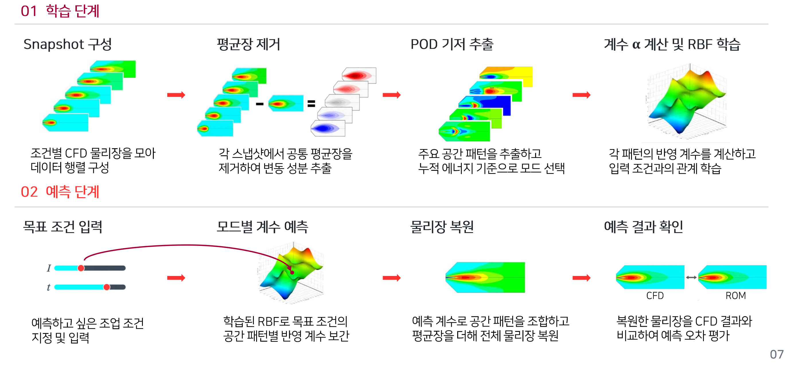
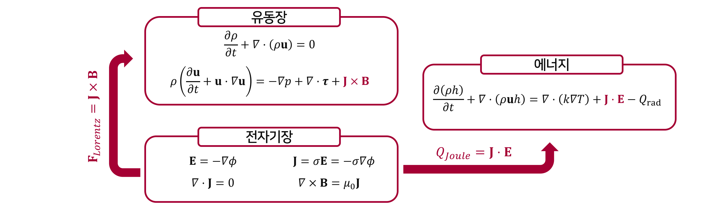
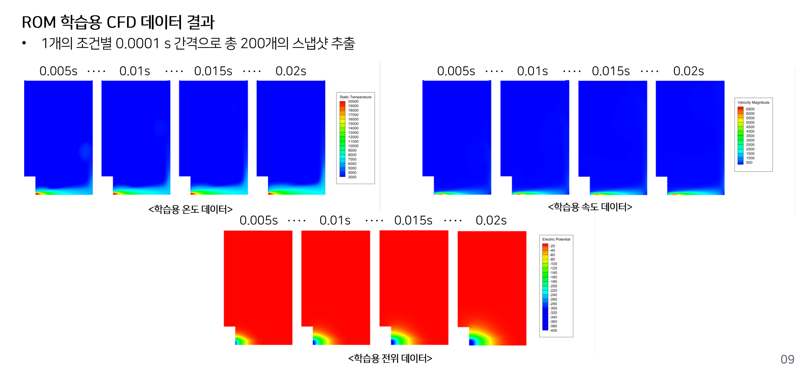
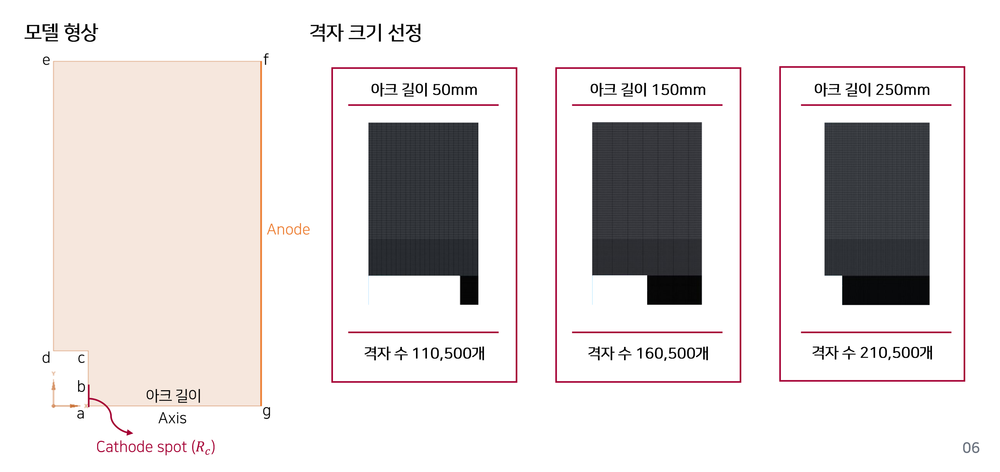
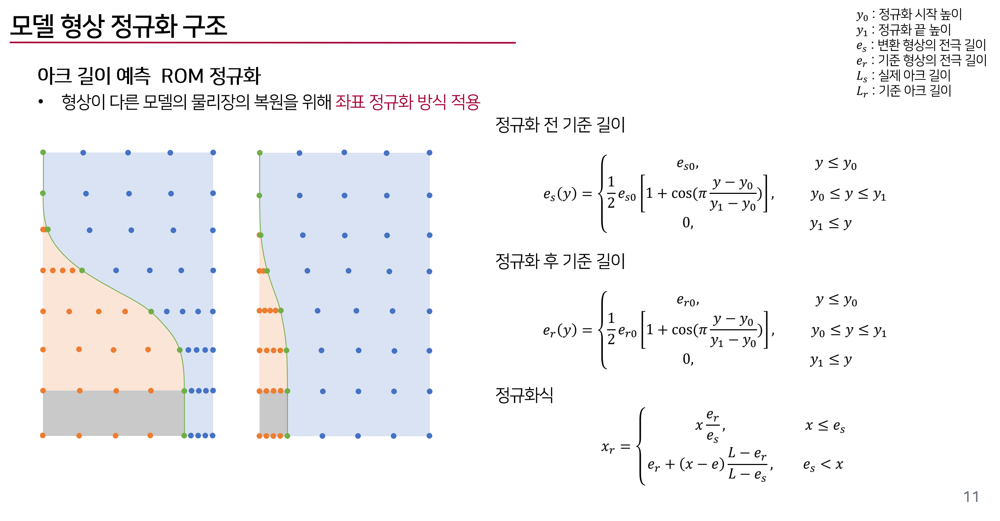
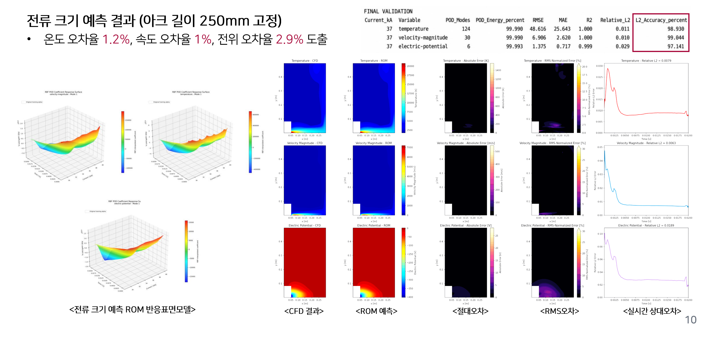
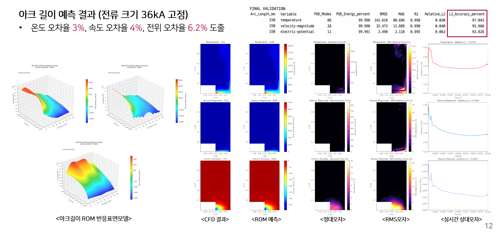
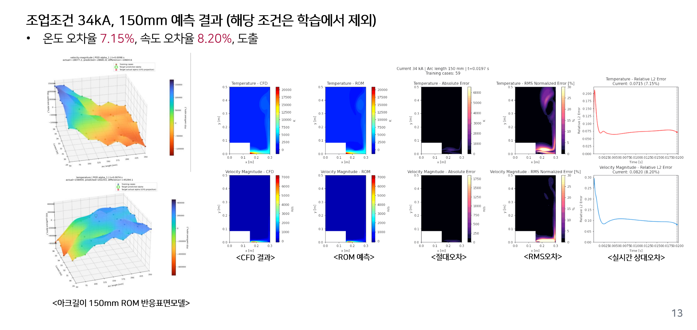

# Developing an ESF Surrogate Model Using RBF-ROM

*How POD compression, RBF interpolation, and geometry normalization turn expensive plasma-arc simulations into fast predictions of ESF flow fields.*

An electric smelting furnace (ESF) converts electrical energy into heat through a plasma arc. Changing the current or the electrode-to-anode gap changes the temperature, the high-speed jet, and the electrical-potential field. Predicting those changes requires a model that connects fluid motion, heat transfer, and electromagnetism.

CFD can resolve that coupled behavior, but repeating a transient calculation for every operating condition is expensive. This raises a practical question: **can the information already contained in CFD simulations be reused to predict new conditions much faster?**

The study summarized here uses a **POD-RBF reduced-order model** to do exactly that. Proper orthogonal decomposition (POD) identifies dominant spatial patterns in the CFD data. Radial basis function (RBF) interpolation predicts how strongly those patterns contribute at a target condition. Combining the predicted contributions reconstructs the field.

The work also addresses a challenge that is easy to overlook: changing the arc gap changes the computational geometry. A coordinate-normalization step aligns fields from different geometries before constructing the reduced representation.

This article summarizes the research methods and results in a technical presentation [1].

*Figure 1. The POD-RBF workflow. The upper row shows snapshot collection, mean-field removal, spatial-mode extraction, and coefficient fitting. The lower row shows a target-condition query, coefficient prediction, field reconstruction, and comparison with CFD. Source: research presentation [1], slide 7.*

## Why an ESF needs a fast field surrogate

An arc model answers spatial questions as well as electrical ones. Where is the hot region concentrated? How far does the plasma jet spread? How does the potential distribution change with the electrode position?

These questions matter when exploring operating conditions. An engineer may need to compare many current and gap combinations before selecting cases for more detailed analysis. Each additional transient CFD run adds computational cost.

A useful surrogate therefore needs to reconstruct the **temperature, velocity, and electrical-potential fields**, preserving the major structures that make the CFD solution informative. The aim is to make repeated operating-condition assessment practical while retaining a quantitative connection to the original simulations.

The presentation reports a comparison of approximately **600 minutes for CFD and 1 minute for the ROM prediction workflow**. That corresponds to a reported speedup of about **600 times** for the compared task. Training-data generation remains an upfront cost; the benefit comes from reusing the resulting reduced model for subsequent predictions.

## The physics behind the training data

The high-fidelity model couples mass, momentum, and energy conservation to electrical and magnetic calculations. Two terms connect the plasma flow to the electromagnetic fields:

$$
\mathbf{F}_{L}=\mathbf{J}\times\mathbf{B},
\qquad
q_{J}=\mathbf{J}\cdot\mathbf{E}.
$$

The Lorentz force influences the jet, while Joule heating supplies energy to the plasma. Temperature affects transport and electrical properties, and fluid motion redistributes heat. The CFD snapshots carry the combined response of these interacting processes.

*Figure 2. The coupled CFD model. Electromagnetic calculations supply Lorentz forces to momentum conservation and Joule heating to the energy equation. The presentation uses a standard k-epsilon turbulence model for the high-speed plasma jet. Source: research presentation [1], slide 4.*

The source specifies cathode currents of **28-36 kA**, a cathode temperature of **4,000 K**, an anode temperature of **1,800 K**, and zero electrical potential at the anode. The electrode walls use no-slip conditions and logarithmic wall functions.

These details define the simulations from which the surrogate learns. Agreement with those simulations establishes reconstruction accuracy for that CFD model and its selected conditions. It does not, by itself, validate the complete furnace against experiments.

## Building a snapshot dataset

The operating-condition ranges in the presentation are:

| Variable | Listed range | Listed spacing |
| --- | --- | --- |
| Current | 28-36 kA | 1 kA |
| Arc gap | 50-250 mm | 25 mm |
| Snapshot sampling interval | 0.0001 s | 0.1 ms |
| Snapshots per condition | 200 | Transient field samples |

The listed current and gap values describe the parameter ranges. They should not be read as proof that every possible combination was used in every training set.

The displayed snapshots include times of **5, 10, 15, and 20 ms**, showing how temperature, velocity magnitude, and electrical potential evolve. A collection of transient fields allows the ROM to represent changes over the sampled time window as well as differences between operating conditions.

*Figure 3. Representative training snapshots. Each operating condition supplies 200 snapshots sampled at 0.1 ms intervals. The panels show selected temperature, velocity, and potential fields across the transient window. Source: research presentation [1], slide 9.*

Sampling interval and CFD time step are different quantities. The 0.1 ms value here specifies the stored-snapshot interval; the presentation does not establish that it is the numerical solver's integration time step.

## POD: finding a compact spatial representation

POD compresses the field data into a set of spatial modes and their coefficients. The presentation describes four steps: assemble the snapshots, subtract the common mean field, extract the modes, and choose a reduced basis using cumulative modal energy.

For a discretized field, let $\mathbf{q}^{(m)}$ denote snapshot $m$. A centered snapshot matrix can be written as

$$
\mathbf{X}=\left[
\mathbf{q}^{(1)}-\overline{\mathbf{q}},\ldots,
\mathbf{q}^{(M)}-\overline{\mathbf{q}}
\right].
$$

A standard algebraic description uses a singular value decomposition:

$$
\mathbf{X}=\mathbf{U}\mathbf{\Sigma}\mathbf{V}^{\mathsf T},
\qquad
\mathbf{q}\approx\overline{\mathbf{q}}+
\sum_{j=1}^{r}a_j\boldsymbol{\varphi}_j.
$$

The spatial modes $\boldsymbol{\varphi}_j$ are basis patterns, and the coefficients $a_j$ determine their contribution to a reconstructed field. This notation explains the mean-removal and mode-combination steps shown in the presentation; it is not an additional reported experiment.

The reduction is useful because the number of retained modes can be much smaller than the number of field values in a CFD snapshot. The current-variation validation table, for example, reports **124 temperature modes, 30 velocity-magnitude modes, and 6 electrical-potential modes**, with retained POD energy close to **99.99%**.

Those counts also show that the fields have different compression requirements. One shared mode count need not be appropriate for all quantities.

A high retained-energy percentage describes representation of the training snapshots. Prediction at a new condition also depends on the accuracy of the coefficient interpolation and, when geometry varies, the coordinate mapping.

## RBF: predicting coefficients at a new condition

Once the basis is available, the next task is to predict its coefficients. The presentation uses RBF interpolation to relate the input conditions to each mode's contribution.

A schematic RBF interpolant for coefficient $a_j$ is

$$
\widehat a_j(\boldsymbol{\mu})=
\sum_{m=1}^{N}w_{jm}\,
\psi\!\left(\left\|\boldsymbol{\mu}-\boldsymbol{\mu}_m\right\|\right).
$$

Here, $\boldsymbol{\mu}$ represents the input coordinates for the particular ROM query, $\boldsymbol{\mu}_m$ are training coordinates, $\psi$ is a radial kernel, and $w_{jm}$ are fitted weights. The equation illustrates coefficient interpolation. The presentation does not specify the kernel family, regularization, or all fitting settings.

The illustrated response surfaces include operating variables and time. Predicting a point on a coefficient surface supplies the weights needed to reconstruct the corresponding field. The time-dependent plots demonstrate predictions over the sampled transient window; arbitrary long-term evolution requires separate evaluation.

POD-RBF interpolation belongs to an established family of non-intrusive reduced-order methods. For example, Xiao and colleagues describe a POD-RBF approach that constructs a reduced model from high-fidelity solutions without modifying the original solver. That work supplies methodological background, not the ESF results reported here. [Non-intrusive reduced order modelling of fluid-structure interactions](https://www.sciencedirect.com/science/article/pii/S0045782516300068).

## Why changing the arc gap requires geometry normalization

Varying current at a fixed gap leaves the geometry unchanged. Varying the gap moves the electrode boundary and changes the domain represented by the snapshots.

The mesh examples in the presentation illustrate this difference:

| Arc gap | Reported mesh-cell count |
| --- | --- |
| 50 mm | 110,500 |
| 150 mm | 160,500 |
| 250 mm | 210,500 |

*Figure 4. Geometry and mesh variation. Changing the gap changes the electrode position and the computational grid. Fields must be aligned in a common representation before they can form a consistent snapshot matrix. Source: research presentation [1], slide 6.*

Directly comparing raw field vectors from these meshes can mix physical changes with changes in point locations and domain shape. A temperature value near the electrode in one geometry should correspond to the appropriate region in another geometry.

The study uses **coordinate normalization** to map different geometries to a reference configuration. The illustrated mapping uses smoothly varying reference lengths and a piecewise transformation around the electrode-related region. A cosine transition blends the relevant length definitions over a selected interval.

*Figure 5. Geometry normalization. The diagrams compare point locations before and after mapping to a reference geometry. The equations show the smooth length transition and piecewise coordinate transformation used in the presentation. Source: research presentation [1], slide 11.*

This step is a substantial part of the surrogate design. It makes spatial correspondence meaningful when the operating parameter also changes the geometry. The corresponding reconstruction must then be interpreted on the target physical domain.

## Validation when current changes at a fixed gap

The first reported validation varies current while holding the gap at **250 mm**. Its summary table identifies a **37 kA** validation case.

That current is above the listed 28-36 kA data range. It is therefore a limited **extrapolation test**, not simply interpolation between listed training currents.

*Figure 6. Current-variation validation at a 250 mm gap. Response surfaces appear on the left; field comparisons, error maps, and time-dependent relative errors appear on the right. The validation table identifies 37 kA. Source: research presentation [1], slide 10.*

The slide reports errors of approximately **1.2% for temperature, 1.0% for velocity, and 2.9% for electrical potential**. Its tabulated temperature relative L2 value is rounded to 0.011, so the temperature result is best interpreted at roughly the 1% level rather than as a precise universal error bound.

The visual comparisons support the reconstruction of the dominant field structures in that test. The time histories also show that the error changes during the transient, with larger early deviations in some quantities.

Success at 37 kA is useful evidence for the tested nearby condition. It does not establish reliable extrapolation to much higher currents or a different flow regime.

## Validation when the gap changes at a fixed current

The next case fixes current at **36 kA** and evaluates a **150 mm** gap. This assesses the geometry-varying reconstruction after coordinate normalization.

*Figure 7. Gap-variation validation. The reported summary errors are approximately 3% for temperature, 4% for velocity, and 6.2% for potential. Spatial error maps help identify where the reconstruction is less accurate. Source: research presentation [1], slide 12.*

The higher errors compared with the current-only case are informative. Changing the geometry introduces an additional alignment and reconstruction task, and it also changes the underlying physical solution.

The potential field has the largest reported summary error in this comparison. The error maps and time histories are therefore important companions to the headline percentages: they show where and when the reconstruction differs from CFD.

The presentation identifies the 150 mm validation condition, but does not explicitly state in this single-variable slide whether that gap was removed from the relevant training set. The combined-condition example provides an explicit held-out test.

## A held-out combination of current and gap

The combined ROM evaluates **34 kA and 150 mm**, with that operating-condition pair explicitly **excluded from training**. This is a useful test because the model must predict the combined response at a condition it did not directly see.

*Figure 8. Combined-condition validation. The displayed snapshot is at 0.0197 s and reports temperature and velocity relative L2 errors of 7.15% and 8.20%. The coefficient-surface panels and time histories reveal how interpolation quality relates to the reconstructed fields. Source: research presentation [1], slide 13.*

The reported **7.15% temperature error and 8.20% velocity error** correspond to the displayed late-time comparison. They are not guaranteed errors for every time or every current-gap combination. The plotted time histories show larger deviations near the beginning of the transient.

This example demonstrates a meaningful progression from one-variable reconstructions to a combined operating-condition prediction. It also identifies where further work is needed: coefficient interpolation and field alignment must remain accurate as the parameter space becomes more demanding.

## Reading the errors as engineering evidence

The cases should be kept separate when discussing accuracy:

| Evaluation | Condition | Temperature | Velocity magnitude | Electrical potential |
| --- | --- | --- | --- | --- |
| Current variation at a fixed gap | 37 kA, 250 mm | Approximately 1.2% in the slide summary | Approximately 1.0% | Approximately 2.9% |
| Gap variation at a fixed current | 36 kA, 150 mm | Approximately 3.0% | Approximately 4.0% | Approximately 6.2% |
| Explicitly held-out combined condition | 34 kA, 150 mm, displayed time 0.0197 s | 7.15% | 8.20% | Not reported in this comparison |

A common field-level relative L2 measure is

$$
\varepsilon_{\mathrm{rel}}=
\frac{\left\|\mathbf{q}_{\mathrm{ROM}}-\mathbf{q}_{\mathrm{CFD}}\right\|_2}
{\left\|\mathbf{q}_{\mathrm{CFD}}\right\|_2}.
$$

It compares the overall difference between two fields to the magnitude of the reference field. It does not guarantee the same relative accuracy at every mesh point. The presentation's absolute-error maps, normalized-error maps, and time histories provide the local and temporal context needed to interpret a summary value.

For engineering use, a small global error should be considered alongside the quantities that matter for the intended decision. A temperature peak, a narrow jet, or an electrode-adjacent region can deserve closer examination even when the overall field is reconstructed well.

## What makes this approach useful

The study combines several practical strengths.

**It reuses a multiphysics CFD dataset.** The surrogate learns from snapshots produced by the coupled arc model, making existing simulations useful beyond their original operating conditions.

**It predicts full spatial fields.** Temperature, velocity, and potential reconstructions preserve information needed to inspect the arc, rather than reducing the output to a single response value.

**Its reduced representation is inspectable.** Spatial modes and coefficient surfaces expose how the model represents the solution. Their connection to the reconstructed field can be examined directly.

**It treats geometry variation as part of the modeling problem.** Coordinate normalization addresses a practical obstacle to building a ROM across different electrode gaps.

**It combines speed with quantitative assessment.** The reported timing comparison is accompanied by CFD-to-ROM field comparisons, spatial error maps, and transient error curves.

POD and RBF are established tools. The contribution highlighted here is their application to coupled ESF arc fields, together with geometry normalization and staged operating-condition validation. The presentation supports that practical contribution; it does not establish a first-ever claim for POD-RBF itself.

## From a surrogate to operating-condition assessment

The model offers a route to screening candidate operating conditions before committing to additional expensive CFD runs. Within a validated domain, a query can return approximate spatial fields and help identify cases that deserve closer analysis.

The reported reduction from 600 minutes to 1 minute makes that repeated-query use attractive. The presentation does not provide a complete hardware-normalized benchmark or separate every component of the prediction workflow, so the factor should remain tied to its reported comparison.

A digital twin is a broader objective. Applying this surrogate in one would also require measurements, state updates, and checks that the simulated conditions represent the current furnace. The presentation identifies digital-twin application as a motivation and direction for development.

Its future plans include more validation at unseen conditions, analysis of local errors where the fields change sharply, extension to alternating-current conditions, and further development of combined current-gap-time predictions.

The central idea is reusable: **compute detailed physics offline, compress its spatial structure, and interpolate the reduced coefficients for repeated queries.** For an ESF, combining that idea with geometry alignment turns a collection of expensive arc simulations into a useful foundation for faster operating-condition assessment.

## Sources and further reading

**[1]** Technical research presentation on reduced-order modeling for ESF plasma-arc simulation. The study-specific ranges, meshes, validation figures, and timing comparison in this article come from its research slides. Captions retain the original printed slide numbers.

**[2]** D. Xiao, P. Yang, F. Fang, J. Xiang, C. C. Pain, and I. M. Navon. [Non-intrusive reduced order modelling of fluid-structure interactions](https://www.sciencedirect.com/science/article/pii/S0045782516300068). *Computer Methods in Applied Mechanics and Engineering* 303, 35-54 (2016). DOI: 10.1016/j.cma.2015.12.029. Background on the established POD-RBF method; its numerical results are separate from the ESF study.

For the physical-model background, see [Magnetohydrodynamics for Arc Plasma Modeling](https://victorystring.github.io/Seunghyun_website/blog/magnetohydrodynamics-for-arc-plasma-modeling/). For a related study of three-dimensional arc behavior, see [From Laminar to Turbulent Arcs](https://victorystring.github.io/Seunghyun_website/blog/from-laminar-to-turbulent-arcs-multiphysics-modeling-of-arc-instability-and-electrical-resistance-in-electric-smelting-furnaces/).
