# From Laminar to Turbulent Arcs: Multiphysics Modeling of Arc Instability and Electrical Resistance in Electric Smelting Furnaces

*How flow regime, three-dimensional arc deformation, and furnace atmosphere shape the electrical load of an electric smelting furnace.*

A plasma arc in an electric smelting furnace is a moving, conducting fluid. Its temperature, flow, magnetic field, and current path evolve together. Even when the current and electrode position are fixed, the arc can bend and lengthen, changing the voltage required to sustain it.

Our study connects these coupled dynamics to a practical question: **what determines the electrical resistance of the arc, and which modeling choices are needed to predict it?** We investigate currents from **520 A to 36 kA**, compare turbulence treatments, explicitly track three-dimensional arc deformation, and examine how a CO atmosphere changes voltage in short and long arcs.

This article summarizes our manuscript, authored by Seunghyun Sim, Hyeonjin Kim, Seungwon Seo, and Hyunjin Yang, which is currently **under review at Energy Conversion and Management** [1]. The findings described below are results from the submitted manuscript, rather than an accepted publication.

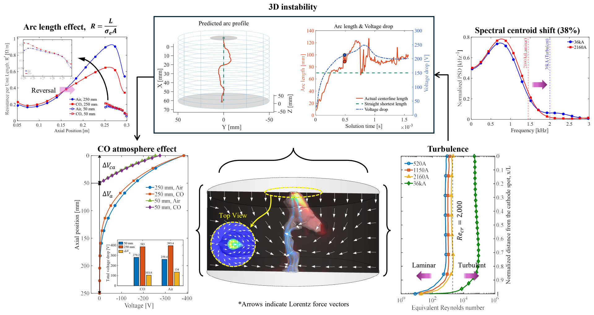

*Figure 1. Overview of the study. Flow regime, current-path geometry, and gas properties are connected through the multiphysics model to explain arc voltage and resistance. Source: manuscript [1], graphical abstract.*

## Why arc resistance matters for electric smelting

Hydrogen-based direct reduction can produce direct reduced iron, or DRI, with less reliance on carbon-based reduction. The next stage still needs to turn that material into liquid metal. When the ore contains substantial gangue, the smelting process must also accommodate a significant slag burden.

Electric smelting furnaces, or ESFs, are candidates for this task. They can supply electrical energy through slag resistance and plasma arcs, depending on the operating configuration. For arc operation, the electrode-to-bath distance is an important control variable, but it does not fully specify the electrical load.

The load also depends on the actual current path, the size of the conducting region, and the temperature-dependent electrical conductivity of the plasma. A straight arc and a bent arc can connect electrodes with the same nominal separation while presenting different resistance.

At a prescribed current, a change in resistance changes the required voltage. Since electrical power is $P=VI$, reliable arc-voltage prediction is directly relevant to estimating electrical energy input and designing power-control strategies. The present study provides a physical basis for that prediction; it does not measure a plant-level efficiency improvement or demonstrate a closed-loop furnace controller.

## What is new about this study?

The contribution is the systematic connection of **flow regime, intrinsic three-dimensional instability, and gas properties** to ESF electrical-load behavior. The paper brings these questions into one modeling framework and tests them over laboratory and industrial-scale current conditions.

Three aspects define that contribution:

1. **Flow-regime-based assessment of turbulence treatment.** An equivalent Reynolds number is used to assess the arc jet before comparing a conventional $k$-$\varepsilon$ model with large-eddy simulation. This helps explain why a model suitable for a fully turbulent industrial arc can introduce excessive momentum diffusion in a lower-current arc.
2. **Explicit geometry and quantitative measures of three-dimensional instability.** Full-domain simulations let the arc bend and change attachment position. An extracted centerline provides normalized arc length and a length-weighted RMS arc angle, connecting visible deformation to changes in voltage and resistance.
3. **An explanation for the reversal of the atmosphere effect with arc length.** At 36 kA, CO produces a higher voltage for a 50 mm brush arc but a lower voltage for a 250 mm long arc. The analysis relates this reversal to radial heat spreading, the conductivity distribution across the arc, and the relative contributions of the near-cathode region and arc column.

These contributions build on established MHD arc modeling, turbulence models, and prior measurements. The novelty is in the questions resolved, the explicit arc-geometry analysis, and the electrical mechanisms demonstrated for the evaluated ESF conditions.

## The multiphysics feedback inside the arc

The plasma is modeled as a conducting fluid with temperature-dependent properties. Mass, momentum, and energy conservation are coupled to electromagnetic calculations.

Two central terms connect the fields:

$$
\mathbf{F}_L=\mathbf{J}\times\mathbf{B},
\qquad
q_J=\frac{|\mathbf{J}|^2}{\sigma_e}.
$$

Here, $\mathbf{F}_L$ is the Lorentz force per unit volume, $\mathbf{J}$ is current density, $\mathbf{B}$ is magnetic flux density, $q_J$ is volumetric Joule heating, and $\sigma_e$ is electrical conductivity.

Current generates a magnetic field, whose interaction with the current produces forces on the plasma. Joule heating changes the temperature. Temperature changes conductivity and other transport properties, while fluid motion carries heat and changes the shape of the conducting channel. The resulting conductivity field then influences where current flows.

This feedback explains why arc resistance cannot be evaluated from geometry alone. The simplified relationship

$$
R=\frac{L}{\sigma_e A}
$$

is useful for interpretation: a longer path tends to increase resistance, while higher conductivity or a larger conducting area tends to decrease it. In the simulated arc, conductivity and cross-section vary in space, so a single uniform value is not a complete representation of the electrical problem.

The simulations use ANSYS Fluent with an in-house MHD implementation for electric potential, magnetic fields, Lorentz forces, Joule heating, and related source terms. Transient time steps range from $10^{-7}$ to $10^{-6}$ s, reflecting the rapid evolution of the arc.

### Separating the questions through the simulation design

| Investigation | Conditions | Modeling approach | Question addressed |
| --- | --- | --- | --- |
| Turbulence treatment | 520, 1150, and 2160 A at a 70 mm gap; 36 kA at 250 mm | Axisymmetric RANS comparisons and a 30-degree, one-twelfth-domain LES | How does flow regime affect mean arc-jet predictions? |
| Intrinsic 3D instability | The same laboratory and industrial current conditions | Full-domain 3D LES | What changes when lateral motion and asymmetric current paths are allowed? |
| Atmosphere effect | 36 kA; 50 mm and 250 mm gaps; air and CO | Steady, axisymmetric simulations | How do gas properties change voltage when 3D instability is excluded? |

The atmosphere comparison is intentionally separated from the full 3D instability analysis. It isolates gas-property effects rather than attempting to simulate all mechanisms simultaneously in every case.

The principal assumptions include local thermodynamic equilibrium, optically thin radiation, and a quasi-steady electromagnetic treatment. The anode is flat, and the molten bath is not explicitly modeled. Keeping the electrode geometry, current, and anode surface fixed helps isolate instability arising within the arc itself.

## First determine whether the arc jet is laminar or turbulent

Temperature varies strongly across a thermal plasma. Density and viscosity also vary, so a Reynolds number based on one arbitrary temperature can provide an incomplete description.

The study uses an **equivalent Reynolds number**, following a formulation that accounts for the radial viscosity distribution [1, 2]:

$$
\mathrm{Re}_{\mathrm{eq}}=
\frac{\bar u d_w}{\nu_{\mathrm{eq}}}
=\frac{4G}{\pi d_w\mu_{\mathrm{eq}}}.
$$

Here, $\bar u$ is cross-sectional mean velocity, $d_w$ is arc-column diameter, $G$ is mass flow rate, and $\nu_{\mathrm{eq}}$ and $\mu_{\mathrm{eq}}$ are equivalent viscosities. The analysis assumes an arc-column radius equal to the cathode-spot radius and adopts a critical value of **2,000** from the reference criterion. This is the criterion used for the present assessment, rather than a universal transition threshold for every plasma geometry.

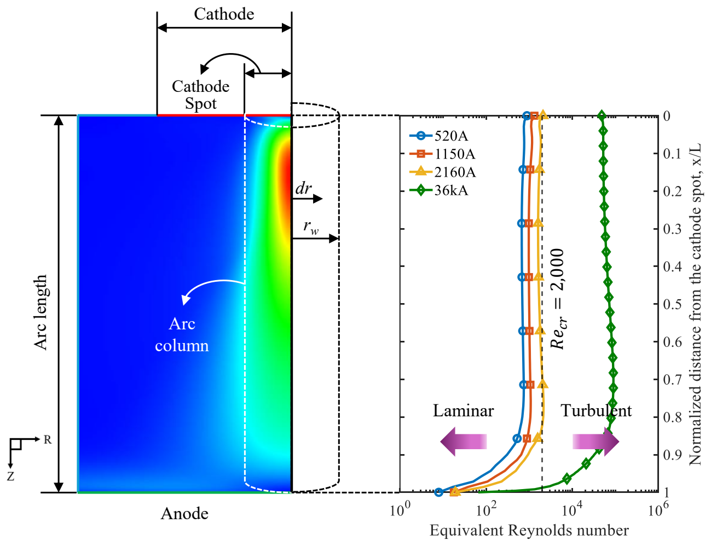

*Figure 2. Flow-regime assessment. The laboratory conditions are below or near the adopted transition criterion, while the industrial 36 kA case is classified as fully turbulent. Source: manuscript [1], Fig. 3; equivalent-Reynolds-number formulation follows reference [2].*

The **520 A and 1150 A cases are classified as laminar**, while **2160 A approaches the transitional regime**. The **36 kA case is classified as fully turbulent**.

The practical implication is that turbulence treatment should follow the flow being modeled. Applying a fully turbulent closure to a predominantly laminar arc can add diffusion that does not represent the actual flow behavior.

## Why turbulence-model choice changes the predicted jet

The $k$-$\varepsilon$ model represents turbulence through averaged quantities and an effective turbulent viscosity. LES resolves larger unsteady structures and models the influence of smaller, unresolved scales. The study uses a WALE subgrid treatment in its LES calculations.

Under laboratory conditions, $k$-$\varepsilon$ without a turbulence-production limiter predicts a lower peak velocity, faster axial decay, and greater radial spreading than LES. The accompanying turbulent-viscosity fields explain this difference.

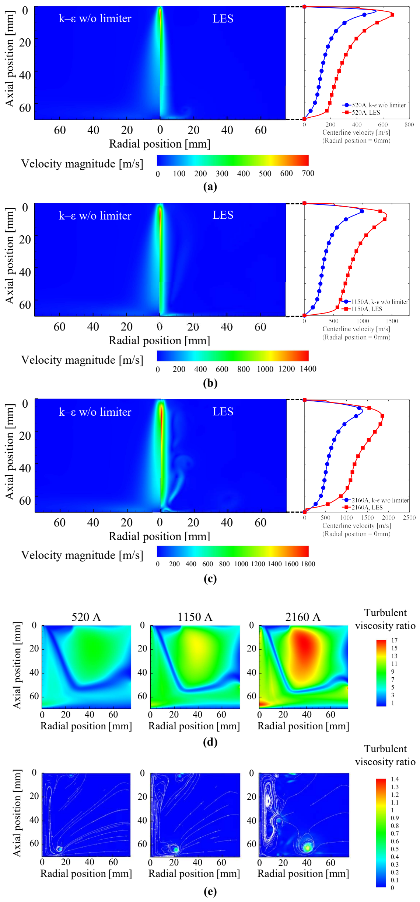

*Figure 3. Turbulence-model comparison at laboratory currents. The uncorrected RANS model produces stronger additional momentum diffusion over a broader region, while the LES subgrid contribution is more localized. Source: manuscript [1], Fig. 4.*

Excessive turbulent viscosity spreads momentum away from the narrow, high-speed jet. A limiter can suppress excessive turbulence production, bringing the RANS results closer to measurements in the tested low-current conditions.

### Comparison with measured velocity distributions

The manuscript compares predictions with Bowman's measured radial velocity profiles at distances of **20, 38, and 55 mm** from the electrode [3]. The comparison includes LES and $k$-$\varepsilon$ results with and without a limiter.

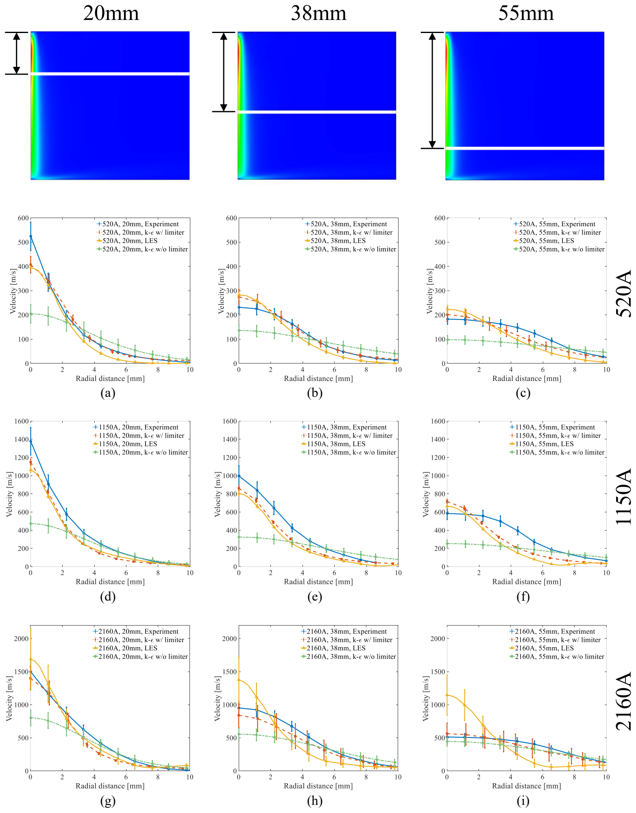

*Figure 4. Velocity validation. Columns correspond to axial sampling positions and rows to current conditions. The source uses measurement uncertainty of plus or minus 11%; the simulation error bars represent their respective modeled or sampled fluctuations. Source: manuscript [1], Fig. 5; experimental data originate from Bowman [3].*

At **1150 A**, the maximum relative velocity error of $k$-$\varepsilon$ without a limiter is **three times that of LES**. This ratio concerns the maximum velocity error in the reported comparison, not an average error across every field or case.

The **2160 A case** reveals another issue. The one-twelfth-domain LES agrees well near the electrode but shows larger discrepancies farther downstream. Its symmetry boundaries restrict lateral motion and help maintain axial momentum. Full-domain simulations later reveal the wobbling that the restricted model cannot reproduce.

This is an instructive example of two different modeling questions: choosing a suitable turbulence treatment and allowing the relevant spatial motion. LES alone cannot recover a motion that the domain boundaries prohibit.

### What changes at 36 kA?

At the industrial current, the one-twelfth-domain LES and the reference $k$-$\varepsilon$ calculation of Alexis and colleagues [4] give similar mean radial profiles at the anode. Their maximum velocity difference remains **within 10%**.

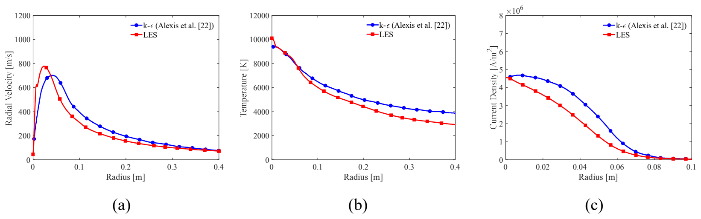

*Figure 5. Industrial mean-profile comparison at 36 kA and a 250 mm gap. Agreement in these constrained mean fields supports the usefulness of RANS for the corresponding task; it does not establish that an axisymmetric calculation captures unstable arc geometry. Source: manuscript [1], Fig. 6; RANS reference from Alexis et al. [4].*

The manuscript also checks arc thrust against prior measurements and a reference correlation over the current range. Thrust is obtained by integrating arc-jet pressure over the anode, providing an additional assessment of momentum transfer.

Taken together, the results support a more selective use of computational effort. A less expensive RANS model can be useful for suitable mean-field calculations at the fully turbulent condition. Predicting asymmetric arc motion and its electrical consequences requires a separate full 3D assessment.

## Turning a changing 3D arc shape into measurable quantities

In an axisymmetric model, the arc is constrained by construction. A sector model also restricts its permitted lateral motion. Full-domain 3D LES removes those symmetry constraints and lets the current-carrying channel deform.

The study goes beyond displaying the arc shape. Its supplementary methodology extracts a centerline from an arc volume defined by a selected current-density iso-surface. A Euclidean distance transform identifies candidate centers through the radii of inscribed spheres. A directional tracking procedure connects those centers, with branching permitted where distinct connected regions appear.

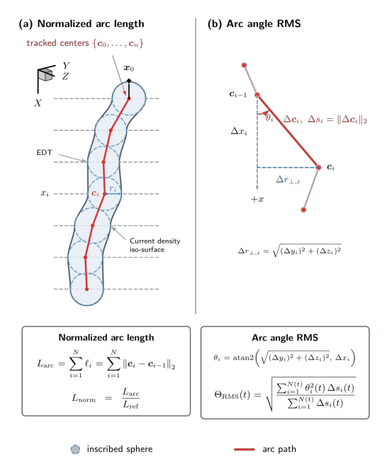

*Figure 6. Geometry-based measures of instability. Tracked centers define the actual arc path, while local segment angles quantify its departure from the reference axis. Source: manuscript [1], Supplementary Information C, Fig. C.1.*

Two complementary measures are then calculated:

$$
L_{\mathrm{norm}}=\frac{L_{\mathrm{arc}}}{L_{\mathrm{ref}}},
\qquad
\theta_{\mathrm{RMS}}=
\sqrt{\frac{\sum_i\theta_i^2\Delta s_i}{\sum_i\Delta s_i}}.
$$

The normalized length measures how much the extracted path exceeds the reference minimum path. The RMS angle measures local bending relative to the reference axis, weighting each segment by its length. Together, they distinguish path elongation from directional deflection.

This quantitative treatment is a central methodological contribution. It makes it possible to relate the evolving arc shape to the electrical response and to compare deformation dynamics across current conditions.

## The 2160 A arc: elongation, bifurcation, and reattachment

At 2160 A, the full 3D simulation initially develops a nearly vertical channel. As the Lorentz-force distribution becomes asymmetric, the channel bends, a new current path forms, and the arc eventually changes its anode attachment.

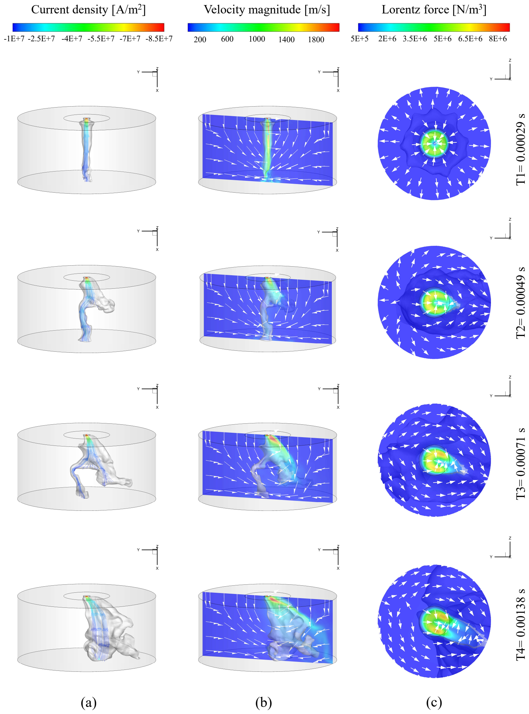

*Figure 7. Arc deformation at 2160 A. The hot channel and current-density streamlines change together as the force distribution becomes asymmetric. The source visualizes the channel with a 7,000 K temperature iso-surface and uses a selected plane for the Lorentz-force contours. Source: manuscript [1], Fig. 7.*

The sequence connects geometry and electrical behavior. A longer current path raises resistance, while Joule heating and heat transport change the temperature and conducting area. During bifurcation, the extracted arc length reaches approximately **1.8 times the shortest path**.

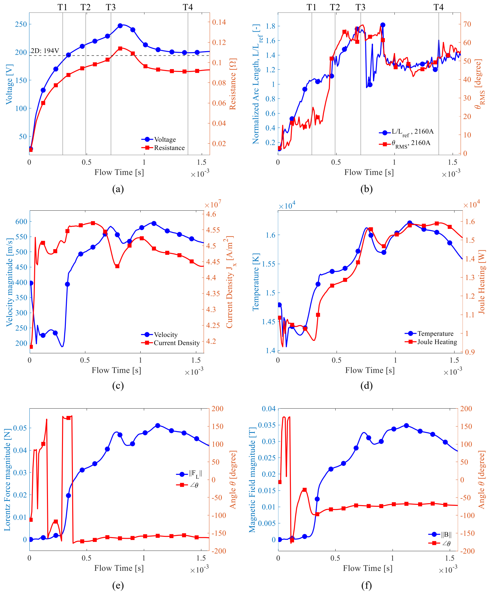

*Figure 8. Electrical and geometric response at 2160 A. Voltage and resistance rise during the strongest elongation, then decrease as a new conducting path develops. The additional plasma quantities use the near-cathode sampling region defined in the manuscript. Source: manuscript [1], Fig. 8.*

At the strongest transient deformation, voltage is **up to approximately 29% higher** than the axisymmetric prediction. After reattachment, the difference decreases to **approximately 3%**.

The reduction has a physical explanation. Expansion of the high-temperature region increases conductivity and conducting cross-section, partly compensating for the resistance increase caused by elongation. Arc length alone therefore does not determine the final resistance.

For this case, a 2D model can approximate the later stabilized voltage much more closely than it captures the transient peak. The simulation demonstrates why the quantity of interest and the time interval both matter when judging model adequacy.

## The 36 kA arc: persistent deformation changes the electrical load

At 36 kA, the full-domain arc also bends and shifts its anode attachment, but its subsequent behavior differs from the laboratory case. Under the fully turbulent condition, deformation and lateral motion persist.

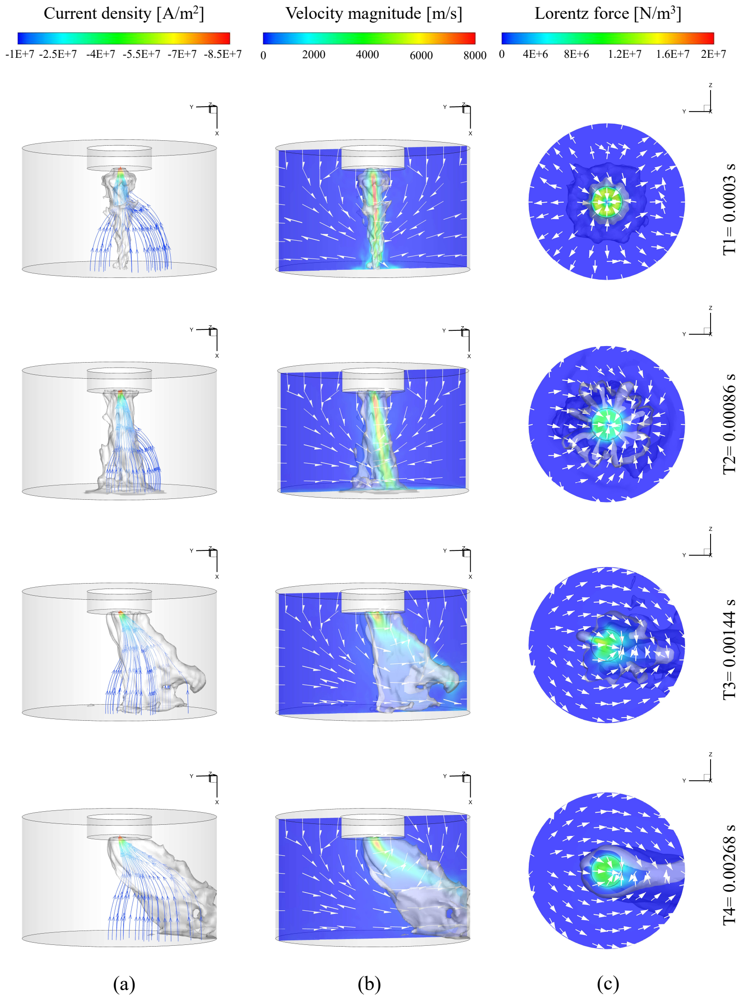

*Figure 9. Industrial-scale arc deformation. The channel continues to bend and the attachment location shifts even with fixed electrode geometry and prescribed current. Source: manuscript [1], Fig. 9.*

The extracted path reaches approximately **2.4 times the shortest electrode-to-anode path**. Continued deformation maintains a longer effective path, and the voltage remains **approximately 35% above the axisymmetric result** during the later stage examined.

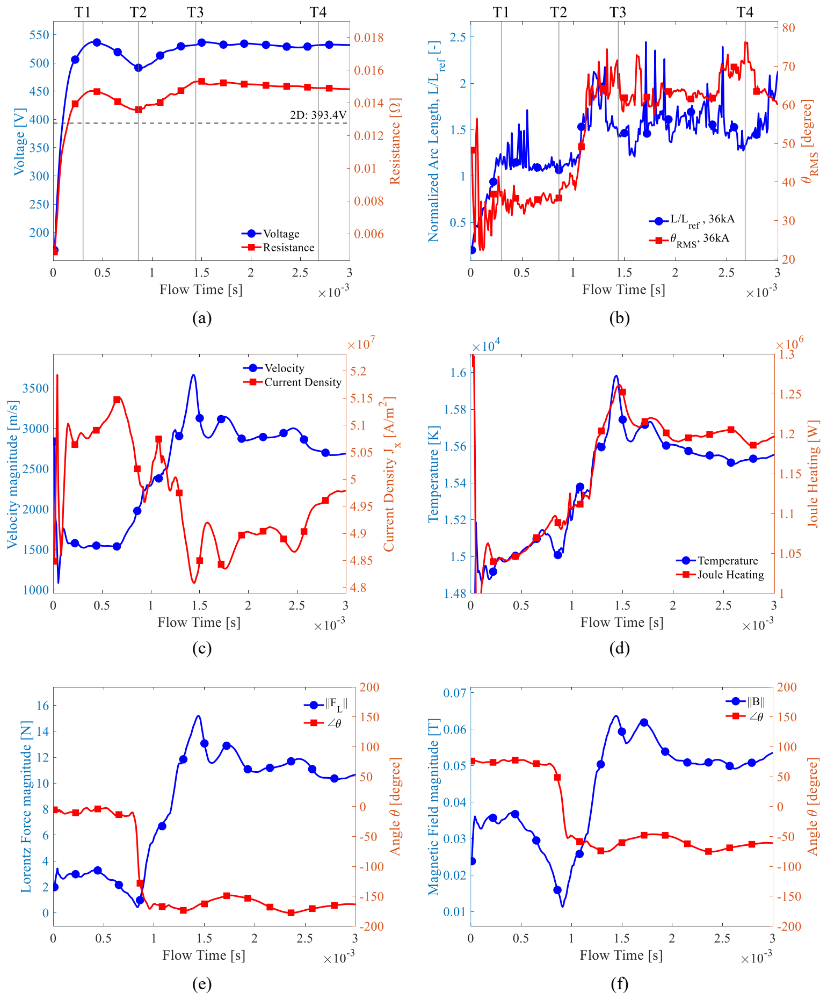

*Figure 10. Electrical response at 36 kA. The voltage remains above the axisymmetric reference while normalized length and RMS angle continue to fluctuate. Mean-profile agreement between turbulence models does not remove this effect of full-domain geometry. Source: manuscript [1], Fig. 10.*

This is one of the most consequential results of the paper. The earlier comparison showed similar mean anode profiles from RANS and restricted-domain LES, yet full 3D geometry produces a substantially different electrical response. A model can represent some mean flow quantities reasonably while missing the current-path changes that matter for resistance.

| Full 3D case | Maximum reported normalized arc length | Voltage difference from the axisymmetric model |
| --- | --- | --- |
| 2160 A, 70 mm gap | Approximately 1.8 | Up to approximately 29% during the transient; approximately 3% after stabilization |
| 36 kA, 250 mm gap | Approximately 2.4 | Approximately 35% persists in the later stage examined |

These percentages compare simulations for the specified conditions. They are not measurements of industrial furnace voltage variability or a claimed reduction in energy consumption.

### Instability also evolves faster at the industrial current

The study analyzes the frequency content of the normalized-length and RMS-angle signals. Compared with 2160 A, their spectral centroids at 36 kA are **39% and 38% higher**, respectively.

A spectral centroid summarizes where the frequency content is centered. The upward shift indicates faster characteristic variation in arc shape in this comparison. It should not be interpreted as a 39% increase in displacement amplitude or a universal instability score.

The geometric signals and electromagnetic diagnostics support a consistent interpretation: turbulent disturbances interact with asymmetric Lorentz forces, and the industrial arc keeps changing its length and direction on shorter characteristic time scales.

## Why the gas atmosphere can reverse the voltage trend

Air is frequently used in arc modeling, while a CO-rich environment is relevant to ESF smelting. Replacing air with CO changes the temperature-dependent properties that enter the coupled equations.

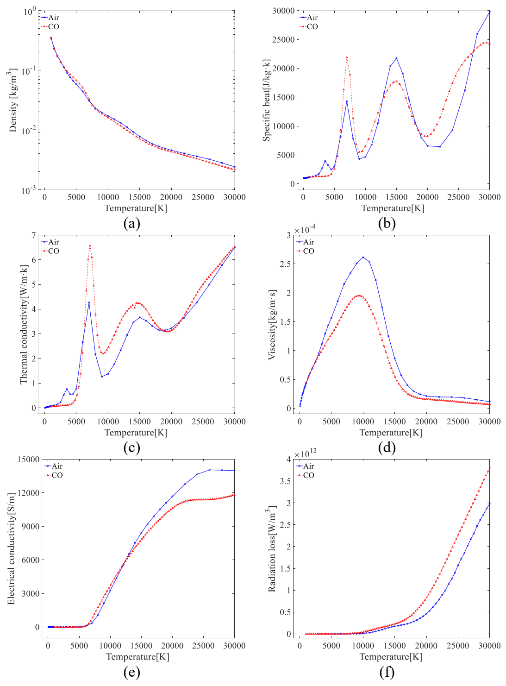

*Figure 11. Air and CO property functions used in the model. Their effects must be assessed over the temperatures actually occupied by the arc, rather than reduced to one constant conductivity. Source: manuscript [1], Fig. 2, which compiles the property data cited in the manuscript.*

The study examines air and CO at the same **36 kA current**, using a **250 mm long arc** and a **50 mm brush arc**. These are steady axisymmetric comparisons, so the interpretation isolates thermophysical effects rather than adding the full 3D instability contribution.

| Electrode-to-anode gap | Air voltage | CO voltage | CO effect relative to air |
| --- | --- | --- | --- |
| 250 mm, long arc | 393.4 V | 383.0 V | 10.4 V lower, approximately 2.6% |
| 50 mm, brush arc | 259.4 V | 279.2 V | 19.8 V higher, approximately 7.6% |

The percentages in the last column are calculated from the manuscript's reported voltages using air as the reference. The direction of the effect changes with arc length.

## Long arc: a wider conducting region can outweigh a hotter core

For the 250 mm case, air produces a higher maximum temperature and higher electrical conductivity on much of the centerline. Looking only at the hot core might therefore suggest lower resistance in air. The complete cross-section tells a different story.

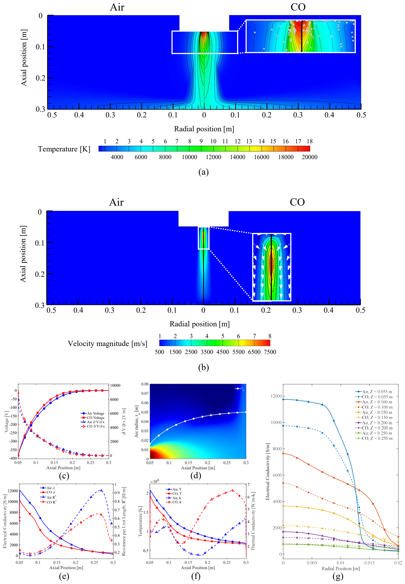

*Figure 12. Air and CO comparison for the 250 mm arc. The radial conductivity profiles show why centerline values alone cannot determine resistance. CO develops a broader conducting region farther along the arc. Source: manuscript [1], Fig. 11.*

CO has stronger radiative losses and, over relevant temperature ranges, greater thermal conductivity. Its core can be cooler while heat spreads farther radially. The surrounding region then contributes to electrical conduction.

The manuscript evaluates local resistance per unit length using the cross-sectional conductivity distribution:

$$
R'(x)=\frac{1}{\displaystyle\int_{A(x)}\sigma_e(x,r)\,\mathrm{d}A}.
$$

This expression explains the apparent paradox. A narrow region with high centerline conductivity can have a smaller total conducting capacity than a wider region with somewhat lower core conductivity. The full cross-sectional integral matters.

Near the cathode, CO has a greater voltage gradient in this comparison. Farther downstream, its broader conducting region lowers resistance per unit length enough to reverse that local trend. Accumulated over the long arc, the result is a lower total voltage in CO: **383.0 V instead of 393.4 V**.

The contribution here is a spatial explanation of the electrical result. A single maximum temperature or centerline conductivity does not adequately describe the resistance of the entire arc.

## Brush arc: the near-electrode contribution remains dominant

The 50 mm brush arc is too short for the downstream reduction in resistance associated with the broader CO conducting region to offset the larger near-electrode contribution.

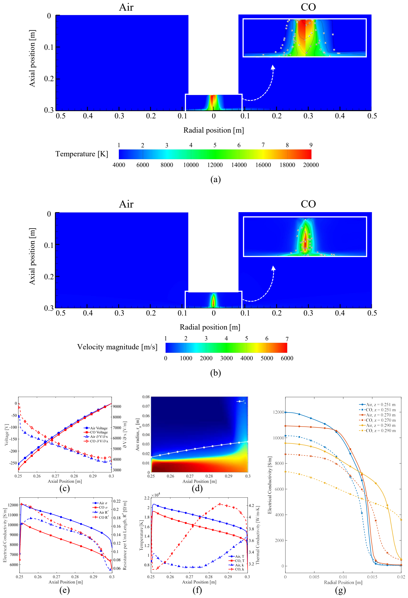

*Figure 13. Air and CO comparison for the 50 mm brush arc. The modeled voltage gradient remains higher in CO, and the total-voltage trend differs from the long-arc case. Source: manuscript [1], Fig. 12.*

The manuscript reports **279.2 V in CO**, compared with **259.4 V in air**. The atmosphere effect is therefore not a fixed correction that can be applied independently of electrode position or operating mode.

The voltage decomposition makes this distinction clearer:

$$
\Delta V_{\mathrm{total}}=
\Delta V_{\mathrm{ca}}+\Delta V_{\mathrm{a}},
$$

where the terms represent the modeled near-cathode and arc-column contributions. This is a regional interpretation of the simulated voltage distribution, rather than an independently resolved non-equilibrium electrode-sheath model.

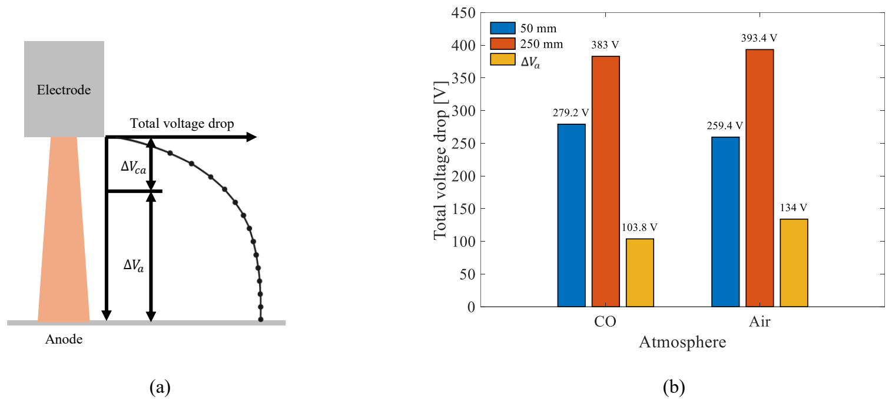

*Figure 14. Explaining the atmosphere-effect reversal. Increasing the gap from 50 to 250 mm adds 134.0 V in air and 103.8 V in CO. The smaller additional column contribution in CO eventually outweighs its larger near-cathode contribution. Source: manuscript [1], Fig. 13.*

Increasing the gap by 200 mm raises voltage by **134.0 V in air** and **103.8 V in CO**. As the arc becomes longer, the column contribution grows in importance, allowing the broader conducting region in CO to determine the overall trend. For the short brush arc, the near-electrode contribution has a greater share of the total.

This explains why both a higher CO voltage and a lower CO voltage can emerge from the same coupled property differences under different arc-length conditions.

## What the results offer for ESF modeling

The study provides a basis for matching model complexity to the engineering question.

For a low-current arc jet, a conventional fully turbulent RANS treatment can introduce excessive diffusion unless its turbulence production is appropriately controlled. For selected industrial mean-field quantities, the less expensive RANS approach can agree well with LES. For the voltage and resistance associated with persistent asymmetric arc deformation, full-domain 3D calculations reveal effects that symmetry-constrained models omit.

The atmosphere comparison adds another requirement: the gas-property model must represent the operating mode and spatial conductivity distribution. A correction fitted to a long air arc cannot be assumed to transfer unchanged to a short CO brush arc.

These are useful strengths of the work because they produce interpretable guidance, rather than only additional temperature and velocity contours. Flow-regime analysis explains a turbulence-model discrepancy; extracted geometry explains an electrical discrepancy; and cross-sectional conductivity explains an atmosphere-dependent reversal.

The fixed-current, fixed-geometry setup is also valuable for mechanism identification. Voltage changes can arise from the arc itself, even before adding electrode movement, a deforming bath, or feed interactions. Understanding that intrinsic contribution helps establish what a more complete furnace model must account for.

## Scope and next steps

The simulations study **DC arcs** under the specified currents, geometries, and air or CO property models. The full 3D examples resolve short transient windows on a millisecond scale; they do not establish long-duration furnace statistics.

The flat-anode assumption excludes explicit arc-bath deformation and feedback. LTE and the radiation approximation also define the physical scope of the model. Pure-gas comparisons clarify mechanisms, while an operating furnace can involve gas mixtures and other interactions that require additional treatment.

Validation against velocity distributions and thrust supports the flow and momentum-transfer predictions. The industrial 3D voltage difference is a model result, rather than a direct validation against full-field measurements inside an operating ESF. Future evaluation can address coupled bath behavior, mixed atmospheres, longer operating histories, and broader electrical measurements.

Within that scope, the main conclusion is clear: **arc resistance is an outcome of coupled plasma dynamics, not simply the electrode gap.** Flow regime determines how momentum transport should be represented, three-dimensional geometry changes the current path, and gas properties reshape the conducting region. Treating those connections explicitly provides a stronger foundation for predictive electrical-load modeling in electric smelting furnaces.

## References and source

**[1]** Seunghyun Sim, Hyeonjin Kim, Seungwon Seo, and Hyunjin Yang. *From Laminar to Turbulent Arcs: Multiphysics Modeling of Arc Instability and Electrical Resistance in Electric Smelting Furnaces.* Manuscript under review at *Energy Conversion and Management*.

**[2]** O. A. Sinkevich and S. E. Chikunov. *A criterion of similarity and transition to turbulence for electric arc flows.* High Temperature 51(1), 17-28 (2013). Equivalent-Reynolds-number reference cited in the manuscript.

**[3]** B. Bowman. *Measurements of plasma velocity distributions in free-burning DC arcs up to 2160 A.* Journal of Physics D: Applied Physics 5(8), 1422-1432 (1972). Experimental velocity reference used in the manuscript's validation.

**[4]** J. Alexis, M. Ramirez, G. Trapaga, and P. Jönsson. *Modeling of a DC electric arc furnace-heat transfer from the arc.* ISIJ International 40(11), 1089-1097 (2000). Industrial RANS reference used in the manuscript's comparison.

All study-specific numerical results and reproduced figures come from manuscript [1] and its supplementary information. Source figure numbers are retained in the captions. References [2]-[4] identify the prior formulation and comparison data discussed in that manuscript.

For background on the coupled equations, see [Magnetohydrodynamics for Arc Plasma Modeling](https://victorystring.github.io/Seunghyun_website/blog/magnetohydrodynamics-for-arc-plasma-modeling/).
