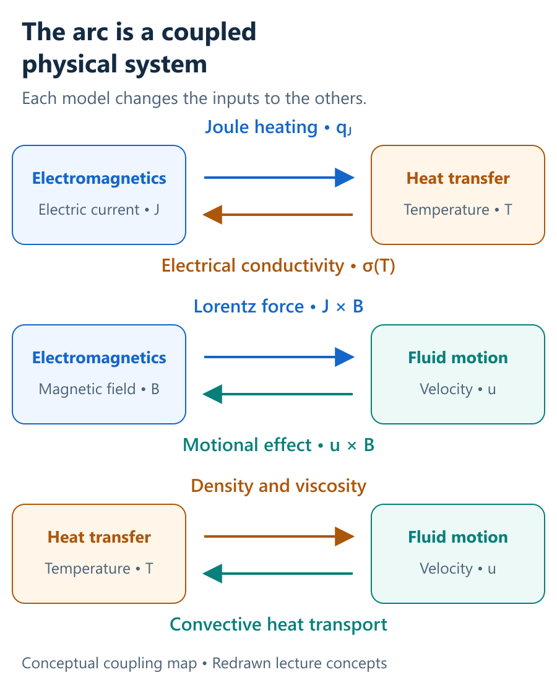
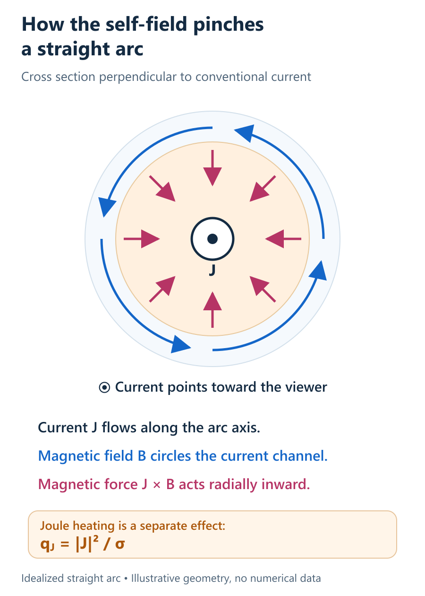
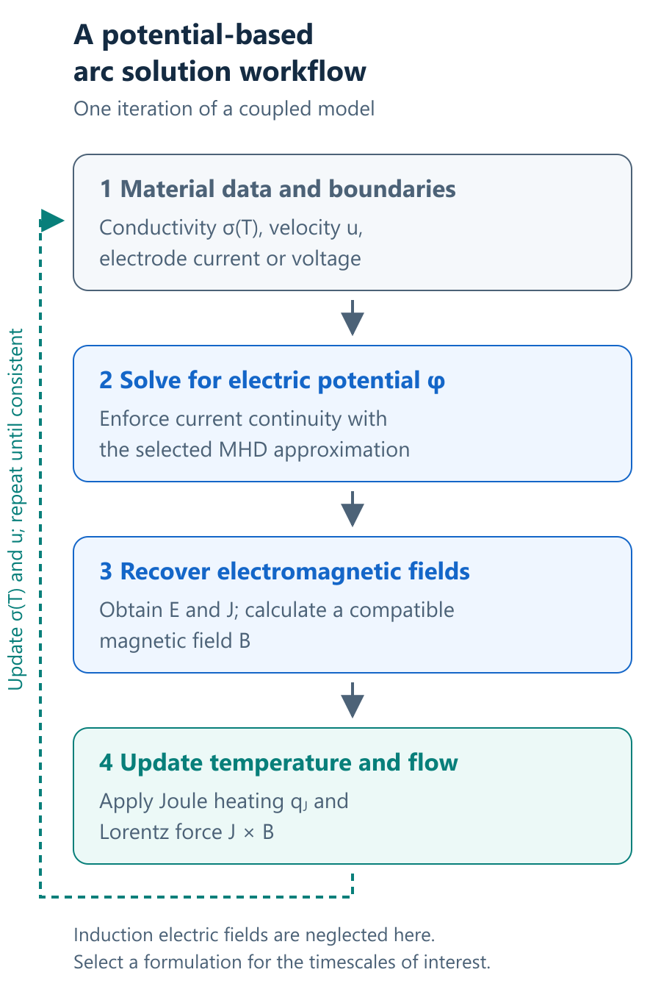

# Magnetohydrodynamics for Arc Plasma Modeling

An electric arc is easy to recognize: a bright, concentrated channel connecting an electrode to another conducting surface. Understanding how that channel heats, accelerates, bends, and interacts with its surroundings requires a model that connects several physical processes.

The arc carries an electric current. That current generates heat and a magnetic field. The magnetic field exerts a force on the conducting plasma, changing its motion. Meanwhile, temperature changes the plasma's electrical conductivity, which changes the current distribution again.

**Magnetohydrodynamics (MHD)** provides a framework for describing these interactions by coupling fluid mechanics with electromagnetism. For thermal arc plasmas, heat transfer completes the connection.

This post introduces the physical meaning of that coupling, the main equations behind it, and the modeling choices that determine what an arc simulation can explain.

## 1. Why model an arc as a conducting fluid?

A plasma contains charged particles, including electrons and ions. Following every particle is usually unnecessary when the question concerns the overall temperature, velocity, or heat transferred to a surface.

Where a continuum description is appropriate, a thermal plasma can be represented through macroscopic fields: density, pressure, velocity, temperature, current density, and magnetic field. MHD connects those fields through conservation laws and material properties.

A common starting point is a single-fluid model with **local thermodynamic equilibrium (LTE)**. In this approximation, electrons and heavy particles have approximately the same local temperature, and equilibrium relations supply the plasma composition and properties. Temperature can still vary strongly from one location to another. Local equilibrium does not mean that the whole arc has a uniform temperature.

This description is useful for many thermal arc applications, but its assumptions need to match the region and operating conditions being modeled. The [COMSOL equilibrium-discharge theory documentation](https://doc.comsol.com/6.4/doc/com.comsol.help.plasma/plasma_ug_equilibrium_discharges.10.10.html) gives one example of how fluid flow, heat transfer, and electromagnetic equations are combined under an LTE approximation.

*Figure 1. An English schematic redrawn from the coupling concepts in the supplied Chapter 3 lecture. Each pair of arrows represents information exchanged between physical models; this is a conceptual diagram, not a simulation result.*

## 2. Current, current density, and conductivity

Three quantities help make the coupling understandable:

| Quantity | Meaning | SI unit |
| --- | --- | --- |
| Current, I | Total charge passing through a chosen cross section per unit time | A |
| Current density, **J** | Local current per unit area, including its direction | A/m² |
| Electrical conductivity, σ | The material's response to an electric field | S/m |
| Electric field, **E** | Electrical force per unit charge | V/m |
| Magnetic flux density, **B** | The magnetic field entering the MHD force law | T |
| Fluid velocity, **u** | Bulk motion of the plasma | m/s |

Current is a scalar associated with an oriented surface; current density is a vector field. Integrating the normal component of **J** over a cross section gives I. Consequently, specifying a total electrode current does not determine how that current spreads through the arc.

That distribution depends on geometry, electrode conditions, and conductivity. In a thermal plasma, σ can change strongly with temperature and also depends on gas composition and pressure. A cold gas and a hot, ionized region therefore offer very different electrical paths.

The bulk fluid velocity is also different from the relative motion of charged species that produces conduction current. A nearly charge-neutral plasma can carry a substantial current because electrons and ions need not move at the same velocity.

## 3. The three expressions at the center of resistive MHD

For a simple isotropic, resistive MHD model, the electrical response and its two main consequences are

$$
\begin{aligned}
\mathbf{J} &= \sigma\left(\mathbf{E}+\mathbf{u}\times\mathbf{B}\right),\\
\mathbf{f}_{L} &= \mathbf{J}\times\mathbf{B},\\
q_J &= \mathbf{J}\cdot\left(\mathbf{E}+\mathbf{u}\times\mathbf{B}\right)
     = \frac{|\mathbf{J}|^2}{\sigma}.
\end{aligned}
$$

The first expression is **Ohm's law for a moving conducting fluid**. The term **u × B** accounts for the motional electromotive effect. This form assumes scalar conductivity and omits effects such as Hall currents and electron-pressure contributions to generalized Ohm's law.

The second expression is the magnetic **Lorentz force per unit volume**, with units of N/m³. It enters the momentum balance alongside pressure, viscous stresses, and other body forces.

At the particle level, the Lorentz force includes both electric and magnetic contributions. In the bulk, nearly neutral MHD approximation, the net electric charge force is commonly neglected while **J × B** remains. This does **not** require the electric field to vanish: an electric field can still drive current and supply power. See the [University of Wisconsin MHD foundations notes](https://magnetohydrodynamics.physics.wisc.edu/lecture1.html) for the single-fluid approximation and its governing equations.

The third expression is **Joule heating per unit volume**, with units of W/m³. It describes irreversible electrical heating in the moving-fluid frame. When the motional term is retained, the laboratory-frame power **J · E** also includes energy transferred into mechanical motion, so it should not automatically be identified with Joule heating alone.

### Magnetic pinching and electrical heating

Consider an idealized straight arc with current directed along its axis. The current produces a magnetic field circling the axis. Their cross product points radially inward, producing a magnetic pinch.

This inward force contributes to constriction of the current-carrying channel. Pressure gradients, gas flow, viscosity, and boundary conditions also influence the resulting arc shape; the pinch alone does not determine it.

*Figure 2. A new schematic illustrating the Lorentz-force concepts in Chapter 3. Conventional current points out of the page, the magnetic field circulates counterclockwise, and the magnetic force points inward. Arrow directions are physical; sizes and colors are illustrative.*

Joule heating raises the plasma temperature, which changes conductivity and redistributes current. The expression qJ = |**J**|²/σ must therefore be interpreted together with the electrical boundary conditions. At fixed local current density, increasing σ reduces this heating term. At fixed electric field with negligible motional effects, **J** = σ**E** instead gives qJ = σ|**E**|². In an actual arc, these local quantities evolve together.

## 4. Connecting MHD to the flow and thermal balances

The conservation equations remain the backbone of the model. MHD supplies additional forces, heat sources, and feedback paths.

| Balance or field calculation | Main role in an arc model |
| --- | --- |
| Mass conservation | Relates density changes to fluid transport |
| Momentum conservation | Determines motion under pressure, viscous stresses, and **J × B** |
| Thermal energy conservation | Balances transport, conduction, Joule heating, radiation, and other retained energy terms |
| Charge conservation | Constrains the current distribution |
| Magnetic-field calculation | Relates the magnetic field to currents and electromagnetic boundary conditions |

Radiation is an energy-loss mechanism that may be significant in a hot arc. Depending on the formulation, the thermal balance can also include pressure work, viscous dissipation, and energy transported by electrons. A model must define which terms it retains and how it represents them.

Properties such as density, viscosity, thermal conductivity, and electrical conductivity then connect the balances. Using temperature-dependent electrical properties while leaving the thermal model inconsistent can break the feedback the simulation is intended to capture.

The practical task is to solve these linked balances with compatible assumptions and boundary conditions, so that a change in current can influence both the temperature and the flow.

## 5. The electric-potential approach

When charge accumulation is negligible, current continuity becomes ∇ · **J** = 0. If the electric field induced by changing magnetic flux can also be neglected, **E** = −∇φ, where φ is the electric potential.

Combining these approximations with Ohm's law gives

$$
\begin{aligned}
\nabla\cdot\mathbf{J} &= 0,\\
\mathbf{E} &= -\nabla\phi,\\
\nabla\cdot\left(\sigma\nabla\phi\right)
&= \nabla\cdot\left[\sigma\left(\mathbf{u}\times\mathbf{B}\right)\right].
\end{aligned}
$$

The divergence form matters when σ varies across the domain. Conductivity should remain inside the divergence operator.

The potential solution provides **E** and **J**, but the magnetic field still requires a compatible calculation. Under a magnetoquasistatic approximation, Ampère's law relates its curl to current, while ∇ · **B** = 0 constrains the field. A magnetic vector potential is one possible formulation.

*Figure 3. A redrawn conceptual workflow based on Chapter 3's electric-potential and coupled-flow discussion. The calculation is repeated as temperature and velocity change. Actual solvers may assemble these equations together or use a different iteration order.*

Electrode current or voltage conditions, an electrical reference, and suitable conditions at other boundaries are necessary to obtain a meaningful solution. The current path may also extend through solid electrodes or a conducting bath, rather than remaining entirely within the plasma.

## 6. When magnetic induction must be retained

The electric-potential approximation above is insufficient when induction electric fields matter. In general, an electromagnetic potential formulation includes the additional term −∂**A**/∂t in **E**, or the magnetic field can be evolved through an induction equation.

For constant scalar conductivity and magnetic permeability, resistive MHD gives

$$
\begin{aligned}
\frac{\partial\mathbf{B}}{\partial t}
&= \nabla\times\left(\mathbf{u}\times\mathbf{B}\right)
 + \eta_m\nabla^2\mathbf{B},\\
\eta_m &= \frac{1}{\mu_{\mathrm{mag}}\sigma},\\
\mathrm{Rm} &= \frac{UL}{\eta_m}
             = \mu_{\mathrm{mag}}\sigma UL.
\end{aligned}
$$

Here ηm is magnetic diffusivity, μmag is magnetic permeability, and U and L are representative velocity and length scales. The first term describes magnetic-field transport and stretching; the second describes resistive diffusion. Variable properties require the corresponding curl form of the resistive term rather than this constant-coefficient Laplacian.

The **magnetic Reynolds number, Rm**, compares these effects. Small Rm indicates weak field advection relative to diffusion at the chosen scales. It does not imply that the arc has no magnetic field or negligible Lorentz force: an imposed current still generates a self-field. Induction caused by externally changing fields also needs its own timescale assessment. The [University of Wisconsin induction notes](https://magnetohydrodynamics.physics.wisc.edu/lecture2.html) explain the diffusivity and Rm scaling.

## 7. Choosing what the arc model needs to resolve

### Equilibrium and electrode regions

LTE can simplify a thermal-plasma model substantially. Near electrodes or colder plasma boundaries, however, electron and heavy-particle temperatures can differ, and charge separation may become important. A two-temperature model or an appropriate electrode/sheath treatment may then be needed. [COMSOL's DC arc example](https://doc.comsol.com/6.1/doc/com.comsol.help.models.plasma.plasma_dc_arc/models.plasma.plasma_dc_arc.pdf) explicitly identifies the sheath region as outside its equilibrium model's validity.

### Axisymmetric or three-dimensional geometry

An axisymmetric model reduces cost and can be a useful starting point for an approximately centered arc. Its symmetry prevents it from representing lateral bending or an asymmetric attachment pattern. A three-dimensional model is needed for those asymmetries; resolving their evolution also requires a time-dependent calculation, with adequate resolution and appropriate physical closures.

### The surrounding process

For an electric smelting furnace, useful outputs may include the heat-flux distribution at the bath, current spreading, and flow driven in conducting liquids. Representing those outputs can require coupling the plasma to electrodes, gas, slag, or molten metal, with suitable interface and material models.

These extensions add physics beyond a single conducting-fluid arc. The broader challenges of equilibrium assumptions, transport properties, radiation, and boundary conditions are discussed in the review [*Arc Plasma Torch Modeling* by Trelles and colleagues](https://arxiv.org/abs/1301.0650).

## 8. What makes a result trustworthy?

A smooth temperature contour is only one output. Useful checks connect the numerical solution back to the balances and observations:

- **Current balance:** Do electrode currents balance, with signs interpreted consistently?
- **Energy accounting:** Are electrical input, mechanical transfer, radiation, and heat leaving the domain accounted for consistently?
- **Resolution:** Do voltage, heat flux, and important arc-motion measures remain stable as the mesh and time step are refined?
- **Model sensitivity:** How much do conductivity data, radiation treatment, and electrode conditions affect the conclusions?
- **Experimental comparison:** Does the model reproduce measured quantities relevant to the question, such as voltage, arc shape, or heat-flux distribution?

A numerical conductivity floor or an imposed hot initial channel may help a calculation converge. Its influence should be examined, and a converged, preheated arc calculation should not be presented as a model of electrical breakdown unless that physics is included.

MHD makes it possible to connect electrical operating conditions with the arc's temperature, motion, and interaction with a process. The value of the model comes from understanding those connections and choosing assumptions that support the specific question being asked.

---

*Source note: This educational overview was developed from supplied lecture material, Chapter 3 (2024), with supporting public references linked in the text. The figures are explanatory redraws or new schematics. No original simulation results are presented.*
