# Pressure-Guided Cross-Modal Reconstruction (PCMR) of Gas-Solid Flow Fields in Fluidized Beds

*How pressure-derived features help reconstruct particle distributions and phase velocities, with millisecond inference and a path toward fluidized-bed digital twins.*

Inside a bubbling fluidized bed, gas and particles continuously rearrange themselves. Bubbles form, rise, merge, and reshape the surrounding particle-rich regions. These structures influence gas–solid contact and mixing, yet the dense particle bed makes them difficult to observe directly.

In our work on **Pressure-Guided Cross-Modal Reconstruction (PCMR)**, we ask whether an available pressure field can reveal those hidden flow structures. We train a U-Net to reconstruct the solid volume fraction and the gas- and solid-phase velocity fields corresponding to the same instant. The strongest result is that explicitly supplying pressure-derived features, especially pressure gradients, improves reconstruction of both particle distributions and phase motion.

This article summarizes the methods and results in our PCMR manuscript, authored by Bong-min Jin, Seunghyun Sim, Seungwon Seo, and Hyunjin Yang [1]. The evaluation uses CFD-generated pressure and target fields. It establishes a pressure-to-flow-field reconstruction capability; obtaining a full pressure field from practical sensor measurements remains a separate research step.

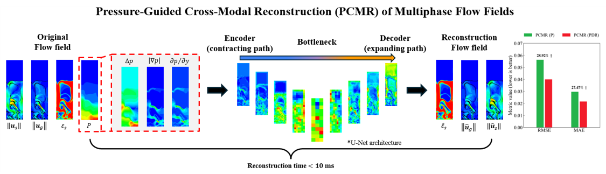

*Figure 1. The PCMR concept: pressure-derived inputs are mapped to corresponding multiphase flow fields. The original fields at the far left provide context and reference; the pressure features in the dashed region supply the reconstruction input. Source: PCMR manuscript [1], graphical abstract.*

## Why reconstruct the internal flow of a fluidized bed?

A fluidized bed suspends and mixes particles through an upward gas flow. This can promote gas–solid contact and heat and mass transfer, making fluidized beds useful in chemical processing, energy systems, and metallurgical applications. Hydrogen-based ironmaking is one motivation for understanding these reactors because fluidized beds can process iron ore without first agglomerating it into larger feed material.

For bubbling operation, the internal distribution of gas and solids matters. A bubble-rich region and a particle-rich region offer different contact environments. Bubble morphology, position, and motion therefore help explain how gas travels through the bed and how particles circulate around it.

Three fields provide complementary views of this behavior:

| Field | What it describes | Why it matters |
| --- | --- | --- |
| Solid volume fraction, $\varepsilon_s$ | The fraction of a local volume occupied by solids | Identifies particle-rich regions, gas-rich bubbles, and the expanded bed structure |
| Gas velocity, $\mathbf{u}_g$ | Local gas motion | Describes gas transport through and around the bubble structures |
| Solid velocity, $\mathbf{u}_s$ | Local particle-phase motion | Describes solids circulation and the motion of the dense phase |

Transient CFD can produce all of these fields. However, it must repeatedly solve the governing equations with small time steps. In the simulations used here, the CFD time step is **0.0005 s**. Generating detailed flow histories is valuable for analysis and training, but the computational burden makes repeated CFD calculations difficult to fit into a rapid monitoring workflow.

PCMR uses those calculations offline to learn a relationship between fields. Once the model is trained and an appropriate pressure field is supplied, it can reconstruct the corresponding target fields directly.

## The core idea: reconstruct another field at the same instant

The term **cross-modal** refers here to reconstruction across different physical quantities. Pressure is the source field; particle distribution and phase velocities are the targets.

For readers familiar with image processing, each CFD cell can be thought of as a pixel whose value represents a physical quantity. PCMR receives a grid of pressure-related values and returns another grid representing a different physical field at the same locations.

A compact conceptual description is:

$$
\Phi(p_t; U_g)
\longrightarrow
\left\{\widehat{\varepsilon}_{s,t},\widehat{\mathbf{u}}_{g,t},\widehat{\mathbf{u}}_{s,t}\right\}.
$$

Here, $\Phi$ denotes the pressure-based input representation, $t$ identifies the current snapshot, and a hat denotes a reconstructed quantity. The manuscript's model configuration also lists the superficial gas velocity $U_g$ as an input feature, so operating-condition information should be accounted for when interpreting the pressure-based mapping. The solid-fraction and velocity reconstruction tasks are trained separately, using the same U-Net backbone.

The model does **not** predict the next flow state from the previous reconstructed state. Each pressure snapshot is processed independently. Consequently, an error in one reconstructed snapshot is not fed back as the starting point for the next reconstruction. This avoids the specific mechanism of recursive error accumulation found in sequential rollout, although reconstruction accuracy still depends on the supplied pressure field and the patterns represented in training.

This distinction defines the intended use. PCMR estimates the current internal state when a source field is available. A forward model that predicts future flow evolution answers a different question.

## Why pressure contains useful information

The choice of pressure is grounded in the two-fluid model used to generate the data. Gas and solids are represented as interpenetrating continua, with:

$$
\varepsilon_g + \varepsilon_s = 1.
$$

The gas and solid momentum equations both contain the same pressure field. Their pressure-force terms are $-\varepsilon_g\nabla p$ and $-\varepsilon_s\nabla p$, respectively. Interphase drag further connects phase distribution and motion through the gas–solid slip velocity, $\mathbf{u}_g-\mathbf{u}_s$.

Pressure is therefore physically coupled to both where particles are located and how the phases move. It is a promising source of information for reconstruction, rather than an arbitrary input chosen only because it correlates with the outputs.

That coupling does not mean pressure alone uniquely determines every possible multiphase flow state. PCMR learns a useful mapping within the flow configurations represented by the datasets. Its performance must be established through held-out evaluations, rather than assumed from the governing equations.

### Making local structure easier for the model to learn

Raw pressure in these beds contains a pronounced variation with height. Bubble-scale features can appear as local distortions within that larger trend. The study therefore compares two input representations:

- **PCMR (P):** the raw-pressure representation used as the baseline.
- **PCMR (PDR):** a pressure-derived representation that explicitly supplies complementary features of the pressure field.

The pressure features include raw pressure $p$, mean pressure $\bar p$, pressure fluctuation $\Delta p$, directional pressure gradients, and the pressure-gradient magnitude $|\nabla p|$. In two dimensions, the directional gradients describe pressure variation across the bed width and along its height. These gradient channels explicitly expose local spatial variation to the network.

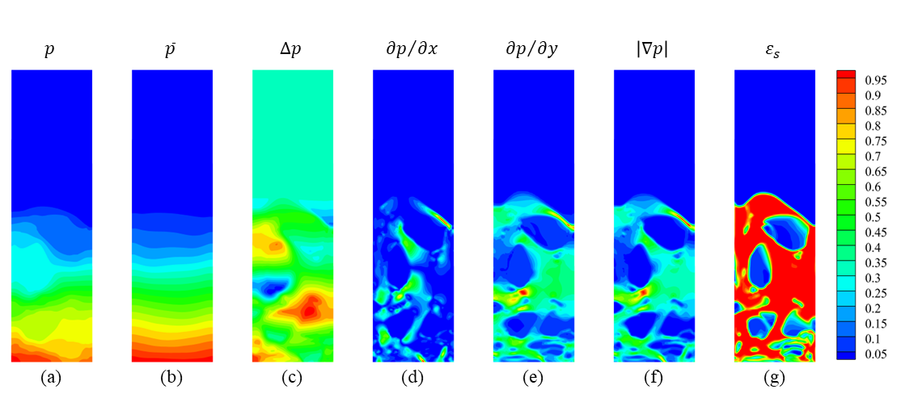

*Figure 2. Pressure representations and the corresponding solid volume fraction at a superficial gas velocity of 0.35 m/s. The gradient-based channels expose localized structure that is less apparent in raw pressure. The channels are normalized; their colors should not be read as a shared dimensional pressure scale. Source: PCMR manuscript [1], Fig. 6.*

The contrast in Figure 2 is central to the paper. Raw and mean pressure mainly show a bed-height trend. The directional gradients and gradient magnitude reveal more localized variations associated with bubbles and the surrounding particle-rich regions.

All of these features are derived from pressure. They do not add an independent measurement of particle concentration or velocity. Their benefit is to make useful aspects of the existing pressure information explicit, helping the network learn the cross-field relationship more effectively.

## Why a U-Net fits this reconstruction task

Pressure and target fields are extracted on the same fixed Eulerian grid. An input location and its corresponding output location therefore refer to the same CFD cell. This makes the problem a natural fit for a network that preserves spatial correspondence.

U-Net combines an encoder, a decoder, and skip connections. The encoder compresses the field while building features at progressively broader spatial scales. The decoder restores the original spatial resolution. Skip connections provide access to finer features from the encoder, helping retain local details that could otherwise be lost during compression.

For this application, that combination supports two needs: representing the overall bed structure and resolving localized bubble morphology and bubble–emulsion interfaces. The outputs are **continuous physical values**, rather than discrete image-segmentation labels.

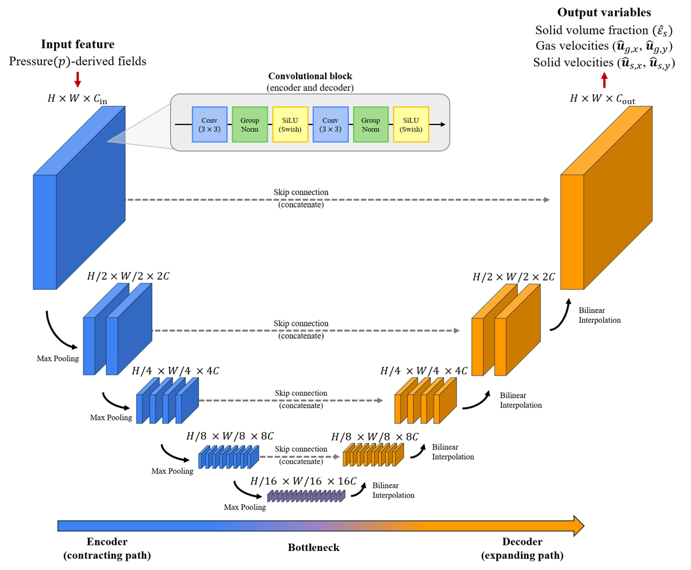

*Figure 3. The reconstruction backbone. The input and output arrays share the same grid locations, while encoder–decoder operations combine local detail with broader spatial context. This schematic represents the shared backbone; solid-fraction and velocity models are trained for their respective tasks. Source: PCMR manuscript [1], Fig. 2.*

The model uses convolution blocks with GroupNorm and SiLU, max-pooling for downsampling, and bilinear interpolation for upsampling in the two-dimensional configuration. The channel progression is **24, 48, 96, 192, and 384**. The reported training settings include a batch size of 16, 100 epochs, and the Adam optimizer with a learning rate of $3\times10^{-4}$.

The role of physics here is in the CFD training data, the selection of pressure-derived features, and the physical targets and evaluation measures. These results should not be interpreted as a demonstration of a physics-informed neural network enforcing the governing equations during inference, or as a guarantee of exact conservation in every reconstructed field.

## How the reconstruction was evaluated

The training pairs come from Eulerian–Eulerian two-fluid-model simulations. Pressure, solid volume fraction, and phase velocities are extracted at the same time, providing spatially aligned input–target pairs. The gas–solid drag is modeled with the Gidaspow closure, and solid-phase stresses and granular temperature use kinetic-theory-based relations.

The two-dimensional datasets use different bed sizes, grids, particle diameters, and initial bed heights. The manuscript classifies the particle systems as Geldart B and examines bubbling fluidization.

| Dataset | Domain and grid | Particle diameter | Main evaluation |
| --- | --- | --- | --- |
| Group 1 | 0.28 m × 1.0 m; 56 × 200 cells | 275 μm | Compare input representations at three held-out interpolation velocities |
| Group 2 | 0.5 m × 2.0 m; 101 × 201 cells | 700 μm | Evaluate the framework on another configuration with different training-velocity selections |
| Three-dimensional case | Cylindrical domain, diameter 0.0965 m and height 0.8 m; 60 × 16 × 64 cells | 540 μm | Compare slice-based and volumetric reconstruction using a temporal split |

After the initial transient, the two-dimensional fields are sampled at 0.020 s intervals: **1,000 snapshots per velocity condition** in Group 1 and **1,500 per condition** in Group 2. The three-dimensional evaluation uses one superficial velocity, 0.57 m/s, with separate training, validation, and test time windows.

The manuscript also checks the CFD datasets against published reference results for time-mean voidage and bubble-probability profiles. This supports the suitability of the CFD reference fields, while the reconstruction results themselves remain comparisons against CFD rather than direct experimental measurements of the reconstructed instantaneous fields.

### Evaluating structure as well as pointwise error

A visually plausible field is not enough. The study evaluates magnitude error, spatial agreement, bubble–emulsion structure, interface position, and integrated solid amount.

The common evaluation region lies below the uppermost reference contour at $\varepsilon_s=0.3$, excluding the freeboard. The same region is used for solid fraction and phase velocities. In this study, $\varepsilon_s<0.3$ identifies bubble regions; this is the adopted criterion for these datasets.

RMSE and MAE quantify errors in physical values. Pearson correlation $r$ measures agreement in the spatial variation. For solid volume fraction, intersection over union at the 0.3 threshold, interface RMSE, freeboard-interface height error, and integrated-solid relative error provide additional structural checks.

For example, the field RMSE is:

$$
\mathrm{RMSE}=\sqrt{\frac{1}{N}\sum_{i\in\Omega_v}\left(\widehat q_i-q_i\right)^2}.
$$

Here, $q_i$ is the CFD reference value, $\widehat q_i$ is its reconstruction, and $N$ is the number of evaluated cells. Solid-volume-fraction RMSE is dimensionless; velocity RMSE has units of m/s. These values should not be compared across variables without accounting for their scales.

## Result 1: pressure-derived features improve particle-distribution reconstruction

The raw-pressure baseline already reproduces the overall bed structure and the major bubbles. This is useful evidence that pressure contains information about the instantaneous distribution of solids.

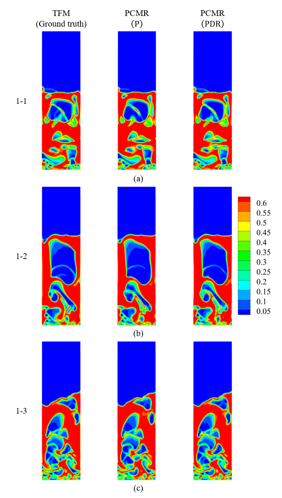

*Figure 4. Solid volume fraction for the three Group 1 interpolation conditions. Each row compares the CFD reference with PCMR (P) and PCMR (PDR). Inspect the bubble positions, shapes, and boundaries within the dense bed. Source: PCMR manuscript [1], Fig. 3.*

The two reconstructions can look similar at first glance. The quantitative comparison reveals the benefit of the richer input representation:

| Group 1 metric | PCMR (P) | PCMR (PDR) | Interpretation |
| --- | --- | --- | --- |
| Solid-fraction RMSE | 0.0563 | 0.0400 | Approximately 29% lower magnitude error |
| Pearson correlation, $r$ | 0.9708 | 0.9854 | Closer agreement in spatial variation |
| Region overlap, $\mathrm{IoU}_{0.3}$ | 0.9329 | 0.9536 | Better agreement of the regions defined by the solid-fraction threshold |

The approximately 29% reduction is a **relative reduction in RMSE**, not a statement that every grid cell becomes 29% more accurate. The manuscript reports a 28.92% reduction using its underlying values; the table values above are rounded.

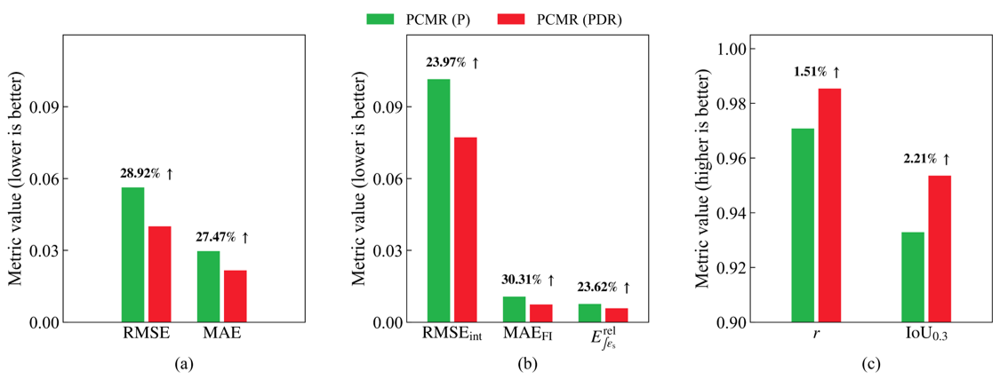

*Figure 5. Quantitative solid-fraction reconstruction performance in Group 1. Error measures decrease with PDR, while correlation and region overlap increase. The panels provide complementary checks on values, interfaces, and structure. Source: PCMR manuscript [1], Fig. 4.*

The improvement extends beyond the whole-field RMSE. Interface RMSE decreases by **23.97%**, freeboard-interface MAE by **30.31%**, and integrated-solid relative error by **23.62%**. These checks matter because errors at bubble boundaries and the top of the bed can be important even when the broader distribution looks correct.

The manuscript also evaluates the worst-performing 10% of samples. PDR retains its advantage there, reducing RMSE by **31.05%** and MAE by **29.14%**. This provides evidence that the benefit is not confined to the easiest snapshots.

## Result 2: the network makes strong use of pressure gradients

The study examines both statistical relationships and the behavior of the trained model to understand why PDR helps.

Among the pressure features, gradient magnitude has the highest reported Pearson and Spearman correlations with solid volume fraction: **0.7484** and **0.9067**, respectively. The height-direction gradient also shows relatively strong relationships. A higher Spearman correlation suggests that monotonic variation is more evident than a strictly linear relationship.

Correlation alone does not establish that the network uses a channel. To test model reliance, the study keeps the trained network fixed and sets one normalized input channel to zero at a time.

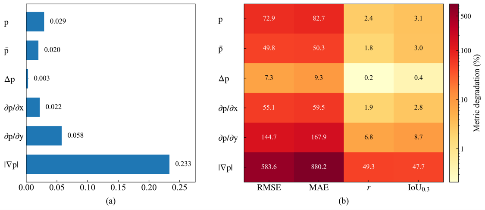

*Figure 6. Sensitivity of solid-fraction reconstruction to removing individual channels from the trained model. Zeroing gradient magnitude produces the largest degradation, followed by the height-direction gradient. Source: PCMR manuscript [1], Fig. 7.*

Zeroing the gradient-magnitude channel increases RMSE by **0.233**, corresponding to a reported **583.6% deterioration** relative to the intact model. This is an input-removal test, not an improvement percentage over the raw-pressure baseline. It shows that the trained PDR network has come to rely strongly on that feature.

The statistical analysis, the field visualization, and the sensitivity test tell a consistent story: local pressure variations carry useful information about gas–solid structures, and explicitly supplying them helps this model reconstruct solid volume fraction.

The sensitivity ranking is specific to the trained model and this zeroing procedure. The channels are related to one another, and setting one to zero changes the input distribution. The test therefore supports model reliance; it should not be treated as a universal ranking of the physical importance of pressure features.

## Result 3: reconstruction extends to both phase velocities

Particle distribution is only part of the internal state. The study also reconstructs the horizontal and vertical velocity components for gas and solids.

Three configurations are compared: raw pressure, PDR, and PDR with reconstructed solid volume fraction as an auxiliary input, denoted **PCMR (PDR + $\widehat{\varepsilon}_s$)**. The auxiliary field provides information about where the solids are located before the model estimates how the phases move.

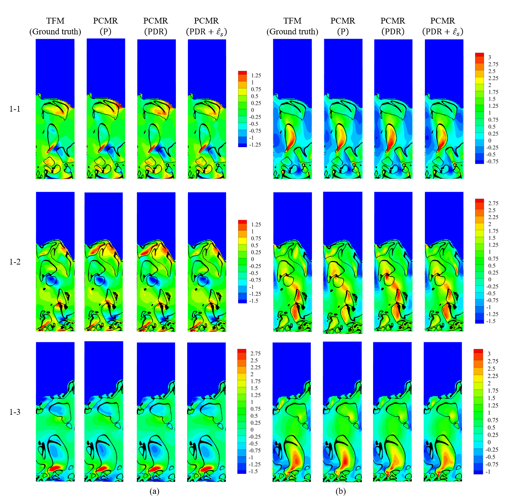

*Figure 7. Gas velocity reconstruction for Group 1. The left block shows horizontal velocity and the right block vertical velocity. Compare the locations and magnitudes of positive and negative velocity regions with the CFD reference. Source: PCMR manuscript [1], Fig. 8.*

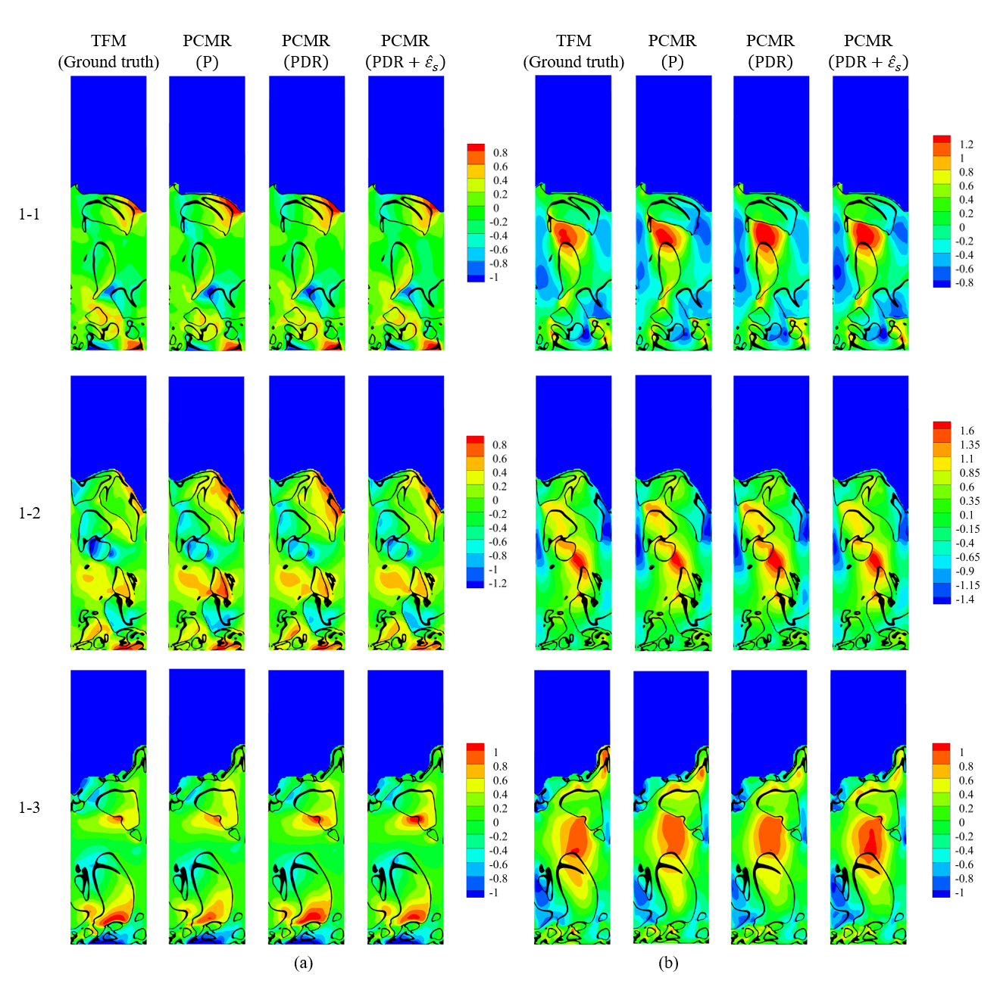

*Figure 8. Solid velocity reconstruction for Group 1. The model captures the main phase-motion patterns, with remaining local discrepancies in the shape and magnitude of velocity structures. Source: PCMR manuscript [1], Fig. 9.*

Across the four velocity components, PDR reduces RMSE by **24.0–26.9%** compared with raw pressure. MAE decreases by **24.1–27.0%**, and the reported relative increase in Pearson correlation is **4.2–5.0%**.

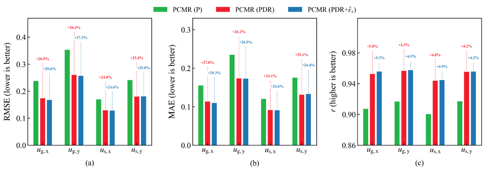

*Figure 9. Velocity reconstruction performance for the three input configurations. PDR provides a clear improvement over raw pressure; the reconstructed solid-fraction input provides a smaller and less uniform additional benefit. Source: PCMR manuscript [1], Fig. 10.*

The auxiliary solid-fraction input improves most components, but the improvement beyond PDR is limited. Some error measures for vertical solid velocity deteriorate slightly. This is an important finding: adding an estimated physical field does not automatically improve every output.

To examine that limitation, the manuscript compares the reconstructed auxiliary field with a CFD reference solid-fraction input under the same conditions. Using the reference field reduces mean velocity RMSE by an additional **20.72%** relative to using the reconstructed auxiliary field. This diagnostic comparison shows that particle-distribution information can help velocity reconstruction, while errors in the first reconstruction stage limit its benefit.

The reference field is not the input used for the reported validation of the practical two-stage configuration. During validation, that configuration receives only the reconstructed solid fraction. During training, a mixture of reference and reconstructed solid fraction is used to reduce the mismatch between training and evaluation inputs.

The result illustrates a broader design consideration for coupled reconstruction models: an intermediate field may carry useful physical information, but its uncertainty can propagate into the next task.

## Result 4: held-out conditions reveal what generalization depends on

In Group 1, each target superficial velocity lies between two training velocities. The targets are **0.38, 0.46, and 0.51 m/s**, excluded from their corresponding training pairs.

Group 2 examines the framework on a different bed configuration and holds the target velocity fixed at **0.62 m/s**. It varies the velocities supplying the training data:

| Group 2 condition | Training velocities (m/s) | Relationship to the 0.62 m/s target |
| --- | --- | --- |
| Near interpolation | 0.53, 0.71 | Target between nearby training conditions |
| Wide interpolation | 0.44, 0.80 | Target between more widely separated conditions |
| Training below the target | 0.44, 0.53 | Target above the training range; labeled lower extrapolation in the manuscript |
| Training above the target | 0.71, 0.80 | Target below the training range; labeled upper extrapolation in the manuscript |
| Combined | 0.44, 0.53, 0.71, 0.80 | More training conditions spanning the target |

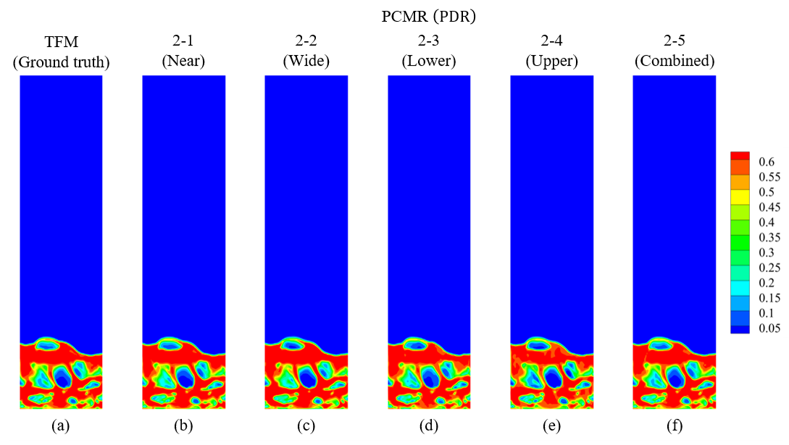

*Figure 10. Reconstruction at the Group 2 target velocity of 0.62 m/s. Each prediction uses a different selection of training velocities. The combined condition gives the best overall quantitative performance in the manuscript. Source: PCMR manuscript [1], Fig. 12.*

The combined condition performs best for both solid fraction and velocity. It benefits from more training data and a broader collection of flow patterns. Among the conditions using two training velocities, training below the target performs better than the wide-interpolation case.

This result cautions against assessing generalization only by asking whether the target parameter lies inside the training range. The resemblance between training flow structures and target flow structures also matters. Interpolation in superficial velocity can still be difficult if the resulting pressure and flow patterns are poorly represented by the training samples.

Group 2 also reveals that solid velocities are harder to reconstruct than gas velocities when their different scales are considered. In the combined condition, RMSE normalized by each reference velocity range is **0.0831 and 0.0896** for the two gas components, compared with **0.1411 and 0.1451** for the solid components. The manuscript relates this difficulty to the more localized and irregular variations associated with solid-phase motion and granular effects.

These tests support the framework across the evaluated configurations. They do not establish that a model trained on Group 1 can be deployed unchanged in an arbitrary new reactor. Group 2 has its own training conditions, so the demonstrated scope is application of the reconstruction strategy to another configuration, together with held-out operating-condition tests within that configuration.

## Result 5: extension to three-dimensional fields

The three-dimensional assessment compares two approaches. **2.5D PCMR** applies a two-dimensional network to individual slices to reconstruct the volume. **3D PCMR** replaces the two-dimensional spatial operations with three-dimensional counterparts, enabling feature extraction across the volume.

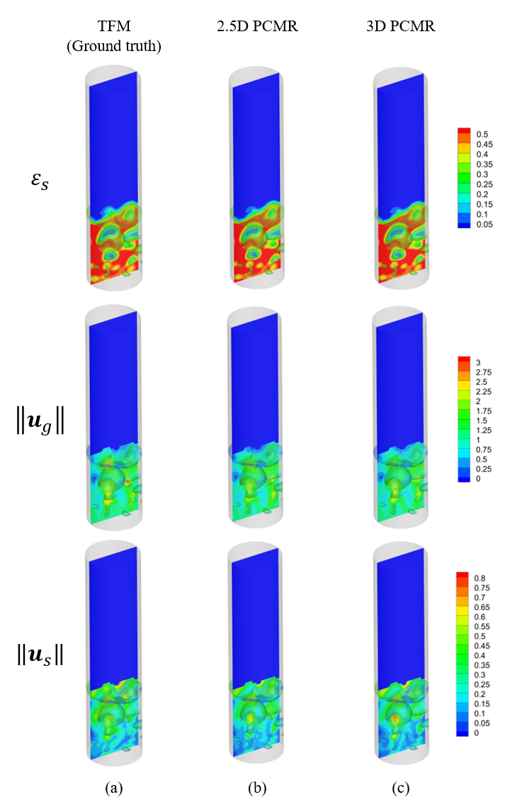

*Figure 11. Three-dimensional reconstruction. Rows show solid volume fraction, gas velocity magnitude, and solid velocity magnitude; columns compare CFD, slice-based reconstruction, and the volumetric model. Source: PCMR manuscript [1], Fig. 17.*

Both approaches reproduce the main three-dimensional structures. The volumetric model provides closer agreement for some localized high-velocity features, particularly in the gas field.

| Three-dimensional assessment | 2.5D PCMR RMSE | RMSE reduction with 3D PCMR |
| --- | --- | --- |
| Solid volume fraction | 0.0153 | 13.60% |
| Gas velocity components, mean | 0.1529 m/s | 16.80% |
| Solid velocity components, mean | 0.0996 m/s | 16.81% |

For solid fraction, Pearson correlation increases from **0.9977 to 0.9983**. The improvement is consistent with the volumetric network retaining information across slices, while the slice-based approach processes spatial features within individual planes.

This assessment uses one superficial velocity and temporally separated training, validation, and test windows. It demonstrates that the framework can be extended to three-dimensional fields under the tested condition. Broader three-dimensional operating-condition generalization remains an open evaluation task.

## What the millisecond inference result means

For the two-dimensional evaluations, the manuscript reports **6.27–8.05 ms per target-field reconstruction** after offline training on an NVIDIA GeForce RTX 4070. It reports reconstruction-stage acceleration on the order of $10^4$ relative to the corresponding two-fluid-model calculations.

The computational saving comes from evaluating a learned field-to-field mapping rather than repeatedly integrating the CFD equations to generate the target field. The reported training times are **18.0–33.2 hours**, depending on the training condition. That cost is paid offline and excluded from the inference comparison.

The timing result must also be read together with the input requirement. The pressure field must already be available. The reported acceleration does not include generating or reconstructing that pressure field, integrating a sensor system, or executing an entire monitoring pipeline. It is not a measured end-to-end speed-up for an operational digital twin, and the two-dimensional timing range should not be assigned to the three-dimensional model without a separate benchmark.

Within that scope, the result is promising: a trained model can turn an available pressure field into detailed multiphase state estimates quickly enough to motivate further work on online reconstruction.

## Strengths of PCMR and the next research step

The main strength of this work is the combination of a physically motivated source field with a reconstruction task that preserves spatial correspondence. Pressure is shared in the two phase-momentum equations, and pressure gradients provide explicit information about local variation. The ablation and statistical analyses help explain why those features improve reconstruction, rather than presenting accuracy alone.

The evaluation also goes beyond a single output or a visual match. It checks particle distribution, both phase velocities, bubble-related structures, difficult samples, held-out operating conditions, and a three-dimensional extension. The independent-snapshot formulation makes its intended role clear: rapid estimation of the current state from an available source field.

For a fluidized-bed digital twin, a plausible future workflow would combine offline CFD data generation and model training with online pressure acquisition, pressure-field estimation, and PCMR reconstruction. The manuscript demonstrates the latter pressure-to-target-field relationship. Connecting sparse, noisy, practical pressure measurements to a sufficiently accurate full pressure field is the next essential step.

Further assessment should examine measurement noise, broader operating ranges, geometry changes, and consistency with experimental instantaneous flow data. Conservation-related diagnostics also remain useful, since reduced integrated-solid error is evidence of improved agreement rather than proof of exact physical constraints.

PCMR shows that pressure contains recoverable information about the hidden hydrodynamics of a bubbling bed. Making that information explicit through pressure-derived features improves the learned reconstruction, and the resulting model offers a fast route from a supplied pressure field to particle distribution and phase motion within the evaluated scope.

## References and source

**[1]** Bong-min Jin, Seunghyun Sim, Seungwon Seo, and Hyunjin Yang. *Pressure-Guided Cross-Modal Reconstruction (PCMR) of Gas-Solid Flow Fields in Fluidized Beds.* Author-provided manuscript.

All research results and reproduced figures in this article come from that manuscript version. Figure numbers in the captions identify the corresponding source figures. The explanatory equations and tables above summarize its methods and reported results.

For related background, see [Understanding Fluidized Beds Through My Research](https://victorystring.github.io/Seunghyun_website/blog/understanding-fluidized-beds-through-my-research/) and [Can AI Learn Physics? Introduction to Scientific Machine Learning](https://victorystring.github.io/Seunghyun_website/blog/can-ai-learn-physics-introduction-to-scientific-machine-learning/).
