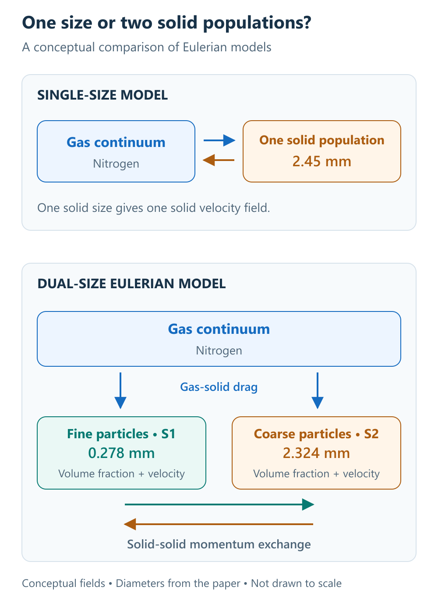
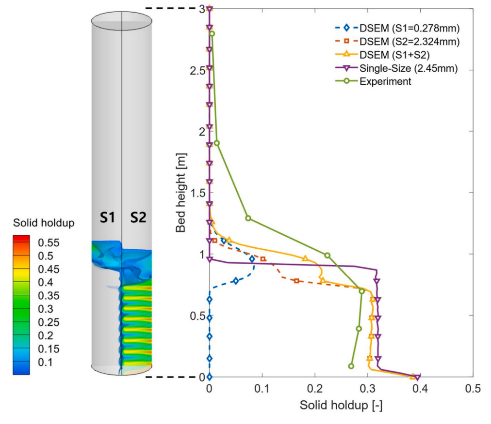
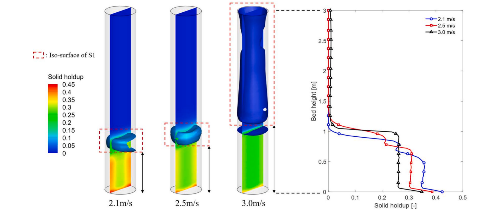

# Understanding Fluidized Beds Through My Research

A fluidized bed can look like a simple system: gas enters from below, solid particles begin to move, and the bed behaves almost like a fluid. Inside that movement, however, particles do not necessarily follow the same path.

Smaller particles can rise into the upper region while larger particles remain concentrated below. Increase the gas flow further, and some fines may leave the reactor altogether. These changes affect how much solid material is present at each height and how the pressure fluctuates over time.

In my research, my coauthors and I investigated this size-dependent behavior using a **Dual-Size Eulerian Model (DSEM)**. We compared its predictions with a conventional single-size model and published experimental measurements.

Our study, published in *Powder Technology*, asks a practical modeling question: **how much understanding can we gain by distinguishing two representative particle sizes instead of treating the entire bed as one size?**

## 1. What happens when a bed becomes fluidized?

Imagine a vertical vessel filled with solid particles. Gas flows upward through the spaces between them. At sufficiently low flow rates, the particles remain largely in place, forming a packed bed.

As the flow increases, the gas exerts enough force to support the bed against gravity. Near the **minimum fluidization velocity**, the bed begins to behave as a mobile gas-solid mixture. Depending on the particles and operating conditions, further increases in flow can produce bubbles, stronger fluctuations, or upward transport of solids.

This mobility is useful because it promotes contact between gas and particles and can improve mixing and heat transfer. Fluidized beds are therefore relevant to processes involving gas-solid reactions, including iron ore reduction.

However, good overall mixing does not guarantee that every particle experiences the same environment. A broad size distribution can produce spatial separation and different residence histories within the same vessel. Understanding that difference was the starting point of our study.

## 2. Why one average particle size can miss the behavior

An Eulerian fluidized-bed model describes the gas and solids as overlapping continuum fields. A conventional single-size formulation represents the solid population using one characteristic diameter.

That simplification can be useful. It reduces the number of fields and interactions that must be solved. But it also removes the distinction between fines and coarse particles: there is only one solid population to transport.

For the iron ore feed examined in our study, the experimental particle-size distribution changed during cold fluidization. Mechanical degradation produced a finer fraction. Representing the bed only through its original coarse distribution therefore missed part of the material present during operation.

We used two representative solid populations:

| Solid population | Representative diameter | What it represents |
| --- | --- | --- |
| S1: fines | 0.278 mm | The fine fraction associated with mechanical degradation |
| S2: coarse particles | 2.324 mm | The coarser iron ore feed |

S1 was selected using an arithmetic mean for the measured 0-1 mm fraction, while S2 used a harmonic mean for the 1-5 mm fraction. The conventional model used a single representative diameter of 2.45 mm.

The objective was to retain a meaningful size distinction with a small number of solid phases. Two diameters still approximate a continuous distribution; they do not describe every particle size in the reactor.

*Figure 1. A new explanatory schematic based on the model described in our paper. Gas, fines, and coarse particles are represented as interpenetrating continua. The boxes identify the modeled populations; this is not a particle-resolved simulation or a scale drawing.*

## 3. What we actually simulated

The motivation comes from hydrogen-based ironmaking, where particle motion affects gas-solid contact, dust loss, and the time available for reduction. The simulations in this paper, however, focused on **cold, non-reacting fluidization with nitrogen**.

This distinction matters. The study evaluates hydrodynamics; it does not directly calculate hydrogen reduction, high-temperature heat transfer, sticking, or industrial ironmaking performance.

The computational geometry reproduced a benchmark cylindrical reactor with an internal diameter of 5 cm and a height of 3 m. The initial bed was approximately 0.56 m high. We simulated superficial gas velocities of 2.1, 2.5, and 3.0 m/s, using a three-dimensional, transient Eulerian-Eulerian formulation in ANSYS Fluent.

The model solves mass and momentum balances for one gas phase and two solid phases. Gas-solid drag and solid-solid momentum exchange couple the populations. The kinetic theory of granular flow supplies solid-phase stress relations through the **granular temperature**, a measure of fluctuating particle velocity rather than thermal temperature.

Each case ran for 30 s of simulated time, with results analyzed over the 10-30 s interval. The 2.5 m/s case provided the main comparison of both pressure drop and axial solid holdup against the benchmark measurements.

The fine population was specified from particle-size measurements. The model distinguishes its transport from that of coarse particles; it does not explicitly simulate the ongoing fragmentation of each particle into new sizes.

## 4. The first finding: one bed can contain different particle environments

At 2.5 m/s, the two populations began from a mixed initial bed and then separated vertically. Coarse particles remained concentrated in the lower region, while fines migrated upward.

This is **segregation**: a change in the spatial distribution of different particle populations. It does not require the particles to leave the reactor. Entrainment, discussed later, is a separate process involving upward carryover and loss through the outlet.

The separation changed the axial **solid holdup**, the fraction of local volume occupied by solids. The DSEM produced a stepwise profile and a more extended particle distribution than the single-size model.

*Figure 2. Reproduced from Figure 5 of [Sim et al. (2026)](https://doi.org/10.1016/j.powtec.2026.122415). At a superficial gas velocity of 2.5 m/s, the left panel shows instantaneous solid holdup contours and the right panel compares time-averaged axial profiles. S1 and S2 identify the fine and coarse populations; the combined DSEM profile is compared with the single-size model and experiment. Original axes, legend, and color scale are retained.*

The characteristic bed height increased from approximately 0.96 m in the single-size calculation to 1.30 m in the DSEM, an increase of about 35%. This comparison refers to the bed-height measure discussed in the paper, rather than the highest point reached by any fine particle.

The populations also occupied different local fluidization conditions. At the validation velocity, the lower, coarse-rich region was interpreted as bubbling, while the upper, fine-rich region exhibited more vigorous behavior consistent with turbulent fluidization. These interpretations were supported by the simulated structures and empirical regime criteria.

For me, the useful insight is that a single operating velocity does not imply a single hydrodynamic environment throughout a bed containing different particle sizes.

## 5. How much did the predictions improve?

We assessed the model using the distribution of solids, the mean pressure drop, and the amplitude characteristics of pressure fluctuations. These quantities test different aspects of the flow.

The principal comparisons at **2.5 m/s** were:

| Quantity | Experimental reference | Single-size model | DSEM |
| --- | --- | --- | --- |
| Axial solid holdup RMSE | Reference profile | 0.0928 | 0.0406 |
| Mean pressure drop | 123 mbar | 144.6 mbar | 135.9 mbar |
| Mean peak pressure difference | 4.84 mbar | 8.37 mbar | 5.09 mbar |

*Values are reported in Sections 4.1.1-4.1.2 and Figures 5-7 of the paper. Solid holdup and its RMSE are dimensionless. Mean pressure uses the manometer reference; mean peak difference uses the differential-pressure-transmitter reference.*

The solid holdup RMSE decreased by approximately **56%**. For mean pressure drop, the relative error decreased from approximately **17.6% to 10.5%**, a reduction of about **7.1 percentage points**.

For pressure fluctuations, the mean peak difference measures the average drop from a local maximum to the next local minimum. The DSEM prediction of 5.09 mbar was much closer to the experimental 4.84 mbar than the single-size prediction of 8.37 mbar. Its relative deviation was approximately 5.2%.

These comparisons support the value of the size distinction in this benchmark. They also show that improved prediction does not mean that all discrepancies disappear: the mean pressure drop remained overpredicted.

## 6. Pressure signals can tell us where the particles are going

Pressure drop is useful because the gas must support and move the material in the bed. Measurements at different heights can therefore contain information about the distribution and motion of solids.

Under an approximate weight-support balance, neglecting frictional and acceleration contributions, the interval-averaged solid holdup can be estimated as

$$
\overline{\varepsilon}_s \approx
\frac{\Delta P}{g\left(\rho_s-\rho_g\right)\Delta L}.
$$

Here ΔP is the pressure difference across a vertical interval of length ΔL, ρs and ρg are the solid and gas densities, and g is gravitational acceleration. This relation is a simplified interpretation of a pressure measurement, rather than a substitute for the full momentum balance.

In the DSEM, pressure signals differed between the lower and upper regions. The coarse-rich lower region exhibited more regular fluctuations. The upper region, where the populations interacted, produced a more complex signal.

During the early upward migration of fines, pressure increased at an upper measurement interval. At the higher gas velocity, the upward progression of pressure responses helped track transport toward the outlet.

The research therefore connects two forms of information: CFD reveals where the populations move, while pressure signals provide an observable response to that motion. Experimental validation remains essential; [NETL's multiphase-flow experiment program](https://mfix.netl.doe.gov/research/laboratory-studies/multiphase-flow-experiment-program/) similarly emphasizes high-quality measurements for developing and validating gas-solid models.

## 7. The second finding: inlet velocity alone does not determine fine-particle loss

At 2.1 and 2.5 m/s, the model showed segregation with a fine-rich region above the coarse bed. At 3.0 m/s, the fines moved farther upward and were eventually entrained out of the reactor.

*Figure 3. Reproduced from Figure 13 of [Sim et al. (2026)](https://doi.org/10.1016/j.powtec.2026.122415). The cases use superficial gas velocities of 2.1, 2.5, and 3.0 m/s. The dashed boxes identify S1 isosurfaces, using a solid volume fraction of 0.05 for 2.1 and 2.5 m/s and 0.008 for 3.0 m/s. Because these thresholds differ, the enclosed volumes should not be compared as equal-concentration regions. The axial profiles on the right show the time-averaged total solid holdup.*

The fine-particle terminal velocity estimated in the paper was approximately 3.22 m/s, slightly above the 3.0 m/s inlet superficial velocity. Yet entrainment occurred.

The explanation involves **local gas velocity**. Superficial velocity is the gas flow rate divided by the full reactor cross-sectional area. Within the bed, the gas travels through the available void spaces, and its local speed can exceed that superficial value. In the simulation, acceleration through the coarse-particle bed exposed fines to velocities high enough to carry them upward.

This is a useful distinction for interpreting operating limits. Comparing an inlet value with a particle terminal velocity alone can miss the local conditions responsible for fine-particle transport.

As fines left the bed, the pressure response also changed. The 3.0 m/s case showed a gradual decline in overall pressure drop after the initial transient, alongside changing oscillations. Pressure was responding to an evolving inventory and distribution of particles.

## 8. What this means for hydrogen-based ironmaking

In a reacting fluidized bed, the location and retention of particles can affect their exposure to reducing gas. Fine-particle carryover and different residence histories are therefore relevant when building a model of hydrogen-based ironmaking.

Our cold-flow results provide a hydrodynamic starting point for that larger problem. They suggest that a useful representative-size choice should preserve the distinction between a coarse population retained in the bed and a fine population vulnerable to upward transport.

They also motivated a proposed segregation indicator based on DSEM bed expansion relative to the single-size baseline. The approximately 35% expansion in the validation case illustrates this idea. Establishing a general predictive correlation would require additional simulations and experiments across different particle distributions and operating conditions.

The study has a defined scope: two fixed size classes, one initial bed composition, three gas velocities, and a laboratory-scale reactor. Direct axial solid holdup validation was available at 2.5 m/s. The pressure reference at 2.1 m/s was interpolated between experimental cases, and the entraining 3.0 m/s case continued to change during the simulated interval.

Further work could add more particle classes, an evolving size distribution, thermal transport, and reduction kinetics. Each extension also increases computational cost and the demands on validation.

The main lesson I take from this research is that a model becomes more informative when it preserves the physical distinction that drives the behavior. In this case, separating fines from coarse particles helped explain where the solids accumulate, how the pressure fluctuates, and why some material leaves the bed.

---

*Research behind this post: Sim, S., Jin, B.-M., and Yang, H. (2026). Numerical investigation of cold fluidization behavior using a dual-size Eulerian model (DSEM): Effects of particle size on hydrodynamics in fluidized bed reactors. Powder Technology, 476, 122415. [Read the paper](https://doi.org/10.1016/j.powtec.2026.122415).*

*This post presents our numerical study and comparisons with the benchmark experiments cited in the paper. Figure 1 is a new conceptual illustration; Figures 2 and 3 are reproduced from the published article. Statements about future reacting systems describe research directions rather than results demonstrated by these cold-flow simulations.*
