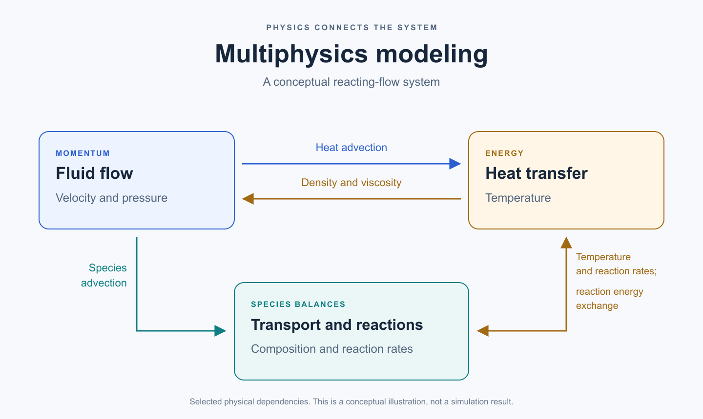
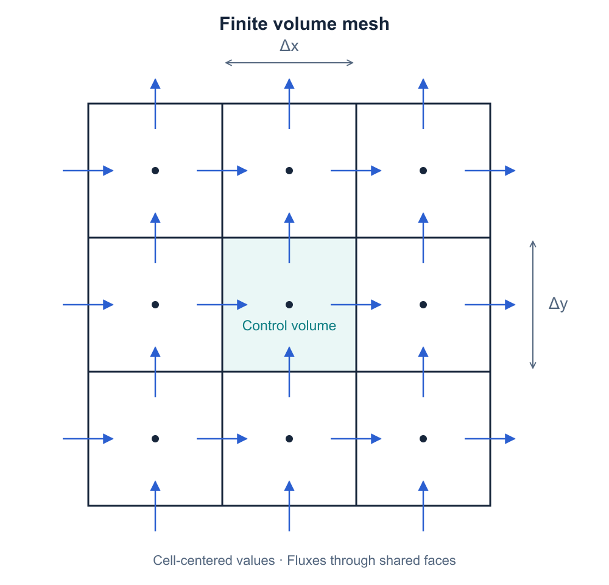
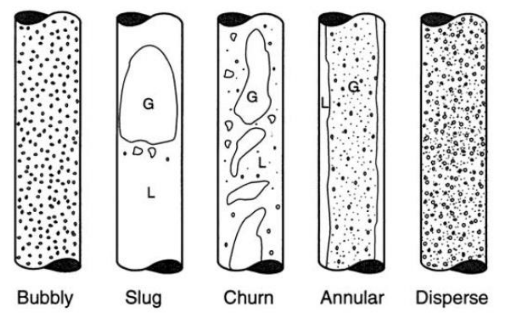

# What Is Multiphysics Modeling and Why Does It Matter?

*How conservation laws, transport processes, and phase interactions help us understand complex engineering systems.*

Imagine a reactor in which hot gas flows through a bed of solid particles. The gas moves the particles, transfers heat to them, and delivers chemical species to their surfaces. Reactions change the composition of the gas and solids, while temperature affects how quickly those reactions proceed.

Which part should we model: the flow, the heat transfer, or the chemistry?

For many engineering questions, we need to consider their interactions. This is the motivation behind **multiphysics modeling**: representing how different physical processes influence one another within the same system.

In this article, I will introduce the mathematical foundations of this approach, explain its connection to multiphase flow, and discuss why choosing the right model matters as much as solving it.

## What makes a model multiphysics?

A fluid-flow model predicts quantities such as velocity and pressure. A heat-transfer model predicts temperature. A chemical-reaction model describes changes in species concentrations.

These become a multiphysics model when information from one process enters the equations describing another. For example:

- A velocity field transports heat and chemical species.
- Temperature changes material properties and reaction rates.
- A reaction consumes or produces species and may contribute to the energy balance.

*Figure 1. An illustrative reacting-flow system. The arrows represent selected physical dependencies, rather than simulation results.*

Coupling can appear as a source term, a material property, a force, or a boundary condition. An electrical model, for instance, can supply a heating term to an energy equation. [COMSOL's explanation of user-defined couplings](https://www.comsol.com/support/learning-center/article/Defining-Multiphysics-Models-Manually-with-User-Defined-Couplings-26881) gives concrete examples of these connections.

The appropriate level of coupling depends on the question. If temperature has little influence on the flow, a prescribed velocity field may be sufficient for a thermal calculation. If temperature changes density enough to drive buoyancy, feedback between the thermal and flow models becomes important.

## Start with conservation laws

Mathematical modeling expresses a physical system in terms of variables, equations, assumptions, and conditions under which those equations apply.

For many continuum models, the starting point is a set of conservation laws:

| Balance | What it describes | Example engineering question |
| --- | --- | --- |
| Mass | How mass accumulates and moves through a region | Does the inlet flow match the outlet flow and accumulation? |
| Momentum | How motion responds to forces and momentum transport | Where do pressure losses and recirculation occur? |
| Energy | How energy is stored, transported, and exchanged | Where might a hot or cold region develop? |
| Chemical species | How individual species are transported, produced, or consumed | Where is a reactant depleted? |

Chemical reactions can consume one species and produce another without creating or destroying the total mass of the reacting mixture.

Conservation laws alone do not provide a complete model. We also need relationships describing material behavior and unresolved physical processes. These are often called **constitutive relations** or **closure models**.

For example, Fourier's law relates conductive heat flux to a temperature gradient. A Newtonian constitutive relation connects viscous stress to the rate of deformation. A Fickian approximation can relate diffusive species flux to a concentration gradient, while a drag model describes momentum exchange between a fluid and particles.

Each relationship has assumptions and a range of applicability. We also need material properties, geometry, initial conditions, and boundary conditions, such as inlet flow rates, wall temperatures, and outlet pressures.

## From equations to a numerical simulation

The governing equations are often partial differential equations. In a complex geometry, obtaining a useful solution usually requires a numerical method.

One way to understand these equations is through a transport balance:

**Accumulation = net transport into a region + generation within the region.**

Transport may involve both **advection**, in which a moving fluid carries a quantity, and **diffusion**, in which gradients drive a flux.

Under a scalar, gradient-diffusion representation, a common differential form is:

$$
\frac{\partial(\rho\phi)}{\partial t}
+ \nabla\cdot(\rho\mathbf{u}\phi)
= \nabla\cdot(\Gamma\nabla\phi) + S_{\phi}.
$$

Here, $\rho$ is density, $\mathbf{u}$ is velocity, $\phi$ is the transported scalar, $\Gamma$ is its diffusion coefficient in this formulation, and $S_{\phi}$ is a source term. The terms represent accumulation, advection, diffusion, and sources, respectively. The actual flux laws and source terms depend on the physical model; this expression is a useful template rather than a complete equation for every phenomenon.

The **finite volume method** applies balances over small control volumes that make up a computational mesh. Fluxes leaving one cell enter its neighbors, so consistent shared-face fluxes support conservation across the domain.

*Figure 2. A control-volume mesh, redrawn from the concept in the source lecture, Chapter 1, page 18. Each cell is a small region over which conservation balances are applied.*

The computer solves the resulting discrete equations to approximate fields such as velocity, temperature, and concentration. Other methods, including finite element and finite difference methods, provide different ways to discretize governing equations.

## Multiphysics and multiphase are different ideas

These terms often appear together, but they describe different aspects of a system.

**Multiphysics** concerns interacting physical processes, such as fluid motion, heat transfer, chemical reactions, and electrical heating.

**Multiphase flow** concerns the motion of more than one phase, such as gas and liquid, or gas and solid particles.

A gas mixture containing hydrogen and water vapor can contain multiple chemical species while remaining a single gas phase. Add suspended solid particles, and the flow becomes a gas-solid multiphase system. Include heat transfer and reactions, and it is also a multiphysics system.

This distinction helps us specify what the model must represent: the phases present, the species within them, and the physical interactions between them.

## Why multiphase systems are difficult to model

The arrangement of phases can change the behavior of a flow. Dispersed bubbles, elongated gas slugs, and a gas core surrounded by a liquid film have different interfaces and exchange mechanisms.

*Figure 3. Illustrative gas-liquid flow regimes from the source lecture, Chapter 1, page 36. The source slide cites Weisman (1983) in its discussion of flow patterns. Regime boundaries depend on fluid properties, geometry, and operating conditions.*

Conservation laws still apply. The challenge is deciding how to represent interfaces, particles, and exchanges of mass, momentum, and energy at the resolution we can afford.

For example, a model that represents the solids as an averaged continuum needs closures for solid-phase stresses and fluid-solid interactions. A model that tracks individual particles must account for particle motion and, where relevant, contacts and collisions.

Neither approach is universally best. A useful comparison is:

| Approach | Basic representation | A reason to consider it |
| --- | --- | --- |
| Eulerian-Eulerian | Phases are represented as interpenetrating continuum fields | Average phase distributions and reactor-scale behavior are the main interest |
| CFD-DEM | The fluid is represented as a continuum and solid particles are tracked discretely | Particle trajectories, contacts, or mixing are important |
| Interface-capturing methods, such as VOF | A phase-fraction field represents a fluid-fluid interface on a mesh | The shape and motion of a resolved free surface matter |

These are starting points for model selection, not rules that guarantee accuracy. NETL's [MFiX overview](https://mfix.netl.doe.gov/products/mfix/) illustrates the distinction between continuum solids models and discrete-particle approaches, including their closure requirements and computational tradeoffs.

Before choosing, define the desired output, expected flow regime, relevant length and time scales, and available computational resources. Predicting an average pressure drop and resolving individual particle contacts are different modeling tasks.

## An example: hydrogen-based ironmaking

Hydrogen-based ironmaking provides a useful setting for thinking about coupled transport and reactions. Consider a generic gas-solid fluidized bed reactor: gas motion affects particle movement and gas-solid contact, heat transfer changes particle temperatures, and species transport supplies reactants and removes gaseous products.

A chemistry model supplied with a spatially uniform temperature and gas composition may miss differences in local reaction conditions. A flow model without reactions cannot describe reactant consumption. Whether those simplifications are acceptable depends on the output we need.

Electric smelting furnaces provide another example. Electrical energy supplies heat, and fluid motion redistributes that heat through the system. Depending on the modeling objective, we may also need to account for free surfaces, multiple material phases, and reactions.

Together, these examples show how a manufacturing process can depend on several connected mechanisms of transport and reaction.

## Why does this matter for engineering?

A well-chosen multiphysics model can help connect a design change to its physical consequences. Changing an inlet arrangement, for example, may alter mixing, temperature distributions, and reactant delivery at the same time.

Simulation can also reveal spatial information that is difficult to measure throughout a reactor, such as recirculation regions or local concentration gradients. This helps us formulate better experiments and identify which measurements are most useful for testing the model.

It can support comparisons between design alternatives before every option is built. The usefulness of those comparisons depends on the accuracy required for the decision and on whether the model captures the relevant interactions.

## A convincing model needs more than a convincing plot

A smooth contour or an attractive animation is not enough evidence of accuracy.

**Verification** examines whether the mathematical model is implemented and solved correctly. **Validation** examines how well the simulation represents physical observations for its intended use. NASA's [CFD verification and validation overview](https://www.grc.nasa.gov/WWW/wind/valid/tutorial/overview.html) explains this distinction.

Useful checks include conservation balances, iterative convergence, mesh and time-step sensitivity, and comparisons with suitable analytical solutions, benchmarks, or experimental measurements. Uncertain inputs and closure assumptions should also be considered when interpreting a prediction. NASA's [grid-convergence tutorial](https://www.grc.nasa.gov/WWW/wind/valid/tutorial/spatconv.html) provides one example of assessing discretization effects.

Adding more physics does not automatically improve a model. It may add uncertain parameters, numerical difficulty, and computational cost. The aim is to include enough detail to answer the engineering question and to test the assumptions that matter to that answer.

## Connecting the pieces

Multiphysics modeling offers a way to connect fluid motion, heat, species, reactions, and other processes through mathematical relationships. Multiphase modeling adds the question of how different phases and their interactions should be represented.

For me, the appeal is the connection between fundamental mechanics and practical engineering questions. A useful model makes its assumptions visible, explains how the important processes interact, and produces predictions that can be checked against evidence.

That is what turns a simulation into an engineering tool.

---

*Source note: The foundational sections draw on introductory lecture material on mathematical modeling and multiphase flow, Chapter 1 (2024). Figure 1 is a new conceptual illustration; Figure 2 redraws a control-volume mesh; Figure 3 reproduces a technical illustration from the lecture. Additional public references are linked in the relevant sections.*
